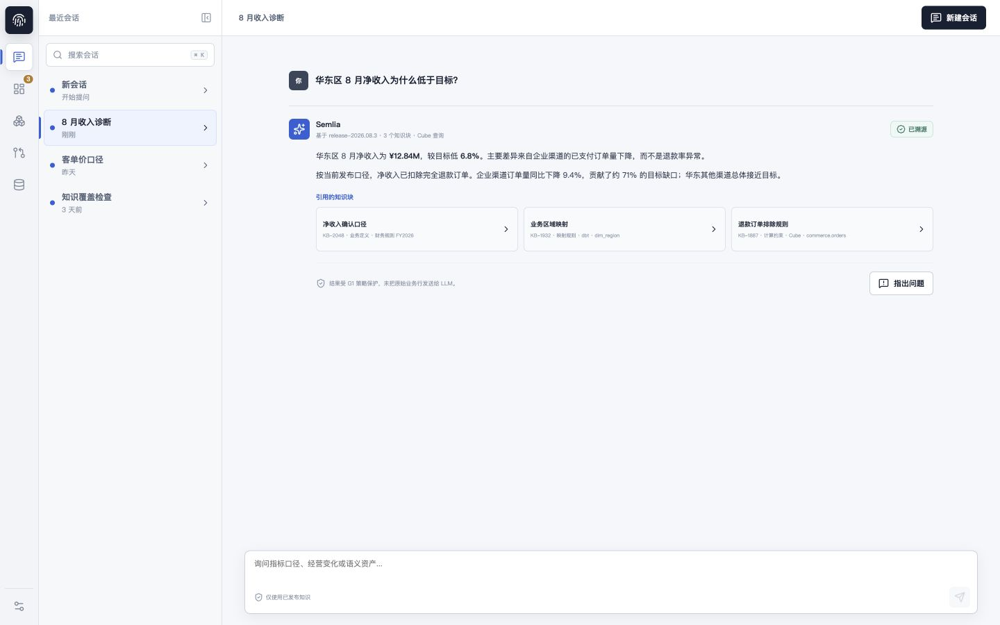

<div align="center">

# Semlia

**面向可信数据与 AI 的开放语义资产控制平面。**

将业务概念、指标、关系、证据和物理绑定转化为人、应用与 AI Agent
可以安全共享的版本化资产。

[English](README.md) | [简体中文](README.zh-CN.md)

[](#项目状态)
[](LICENSE)
[](https://github.com/iiwish/semlia/actions/workflows/ci.yml)

</div>



<p align="center"><sub>生产桌面工作区将真实 PostgreSQL 语义注册中心与明确标识的后续里程碑预览能力合为一体。</sub></p>

## Semlia 是什么？

Semlia 是企业语义资产平台与治理控制平面。它为每一个重要业务概念和指标提供权威、机器可读的知识主页，统一承载定义、计算口径、负责人、血缘、证据、测试、历史、消费者和适合 AI 使用的上下文。

Semlia 不再让业务含义散落在 SQL、看板、文档和 Prompt 中，而是像治理软件一样治理语义：**可发现、可测试、可评审、可发布，并具有兼容性约束**。

Semlia 围绕四个核心理念构建：

- **活的 LLM Wiki**：权威知识页面连接人类可读的含义、证据、所有权、历史与适合 AI 使用的上下文。
- **受治理的本体**：概念、实体、指标、关系、约束和物理绑定共同构成机器可读的组织含义模型。
- **软件级生命周期**：AI 可以生成变更提案，但只有通过测试、策略、证据和审核的内容才能成为已发布事实。
- **可信语义解析**：CLI、MCP、REST、SDK 和事件接口先解析已发布语义，再由可选执行适配器运行查询。

Semlia 不是 BI 看板、Workbook、无限制 ChatBI、数据仓库或查询引擎，而是围绕这些系统建立的语义控制平面。

## 工作原理

```text
来源层               证据层                  语义层                  治理层                 交付层
Catalog / SQL   -->  物理图谱           -->  资产 + 本体        -->  验证 + 审核       -->  REST / MCP / SDK
dbt / 业务文档        血缘 + Provenance       绑定 + 契约             不可变发布              可选查询执行
```

1. **发现**数据集、字段、SQL 血缘、既有定义和支撑证据。
2. **建模**指标、概念、关系、约束、物理绑定和 JoinContract，并赋予稳定身份。
3. **验证**Schema、引用、SQL、粒度、扇出、兼容性、权限和执行适配器能力。
4. **治理**候选变更，以证据、策略、风险分流、人工审核和不可变版本决定发布事实。
5. **交付**同一份已发布语义，通过稳定的无头接口服务于人、应用与 AI Agent。

完整的产品与架构契约请阅读[项目 SSOT](docs/SSOT.md)和[知识治理架构](docs/architecture/knowledge-governance.html)。

## 项目状态

> [!WARNING]
> Semlia 处于 **Pre-alpha** 和**私有孵化**阶段，尚未达到生产可用标准，当前不接受公开贡献。

| 产品面 | 当前状态 |
| --- | --- |
| 生产 Web | 唯一的嵌入式桌面工作区；M1 工作区与 Catalog 使用生成契约和 PostgreSQL |
| 语义注册中心 | 已具备稳定 TypeID、不可变 Revision、证据、有界本体关系、发现适配器、审计、Outbox、Usage 与 Git 投影 |
| 预览能力 | 语义问答、治理式创作、发布编排、来源配置与系统管理保留已确认体验，并等待对应后端里程碑 |
| 公开发布 | 仍需完成生产能力、自托管验证、安全报告渠道、兼容性与发布验收 |

M1 Catalog 已接入真实业务数据，可用于本地业务验收。预览和会话态能力不会宣称已经具备持久化、权限强制执行或外部系统副作用。

## 快速开始

安装 `.tool-versions` 固定的 Go 1.26.6、Node.js 24.15.0、pnpm 11.1.3，以及 Git 和 GNU Make。

确认 Docker 与 Compose 可用后运行：

```bash
make doctor
make bootstrap
make dev
make smoke
```

打开 `http://127.0.0.1:8080` 使用 Semlia 产品工作区。真实 M1 Catalog 支持工作区初始化、
搜索、筛选、资产创建、不可变详情、证据和有界关系；系统诊断保留在 `/status`。

停止环境并保留 PostgreSQL 数据卷：

```bash
make dev-down
```

Smoke 测试会暂时重建当前 checkout 的本地 Compose 环境。完整安装、端口规则和故障恢复路径见[快速入门](docs/quickstart.md)、[本地开发手册](docs/operations/local-development.md)和[故障排查指南](docs/operations/troubleshooting.md)。

## 开发

根目录 `Makefile` 是稳定的开发入口：

| 命令 | 用途 |
| --- | --- |
| `make doctor` | 检查必需工具和本地能力 |
| `make bootstrap` | 安装锁定版本的 Go 与 pnpm 依赖 |
| `make build` | 构建 Semlia 控制平面二进制文件 |
| `make test-repository` | 检查仓库结构和项目政策契约 |
| `make contracts-check` | 检测生成 API 契约是否漂移 |
| `make check` | 运行完整的本地 Pull Request 门禁 |
| `make release` | 构建版本化发布包、SBOM 和校验和 |

## 仓库导览

```text
api/          OpenAPI 契约和生成的公共类型
cmd/          Semlia 命令入口
db/           sqlc 配置与查询
deploy/       容器和部署资源
docs/         产品 SSOT、架构、规格、运维和社区政策
internal/     Go 领域、应用、适配器和平台包
migrations/   版本化 PostgreSQL 迁移
sdk/          生成与维护的客户端 SDK
tests/        契约、集成、验收、Smoke 和仓库测试
web/          唯一的生产 Web 应用与桌面产品体验
```

从[文档索引](docs/README.md)开始阅读。架构决策位于 [ADR](docs/adr/)；当前产品行为与边界以[项目 SSOT](docs/SSOT.md)为准。

## 路线图

- **M0，工程基础**：控制服务、数据库、任务、契约、本地环境、CI、安全和发布机制。
- **M1，语义注册中心**：真实来源发现、物理图谱、语义目录、Revision、证据、所有权、搜索和生产 Web 基础。
- **M2，治理式创作**：AI 提案、验证编排、策略、审核和发布。
- **M3+，分发与持续治理**：可信解析、MCP/SDK 交付、消费者绑定、反馈、漂移治理和开放适配器生态。

里程碑范围和退出标准以 [SSOT 路线图](docs/SSOT.md#17-路线图)为准。

## 贡献与安全

Semlia 尚未开放公开贡献。未来的贡献约定见[贡献指南](docs/CONTRIBUTING.md)，所有参与行为均受[社区行为准则](docs/CODE_OF_CONDUCT.md)约束。

请勿在公开 Issue 中报告安全漏洞。当前私有孵化阶段的限制和未来报告流程见[安全政策](docs/SECURITY.md)。

## 许可证

Semlia 使用 [Apache License 2.0](LICENSE) 开源，归属信息见 [NOTICE](NOTICE)。
