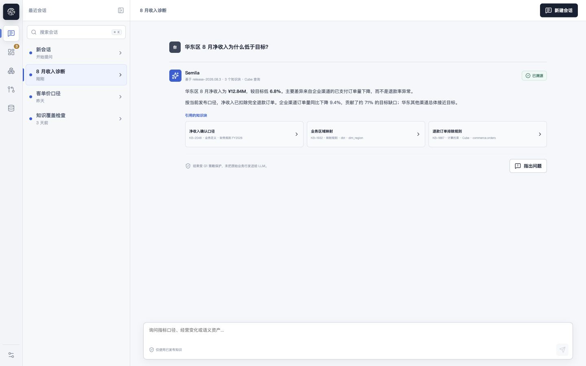

<div align="center">

# Semlia

**面向可信数据与 AI 的开放语义资产控制平面。**

将业务概念、指标、关系、证据和物理绑定转化为人、应用与 AI Agent
可以安全共享的版本化资产。

[English](README.md) | [简体中文](README.zh-CN.md)

[](#项目状态)
[](LICENSE)
[](https://github.com/iiwish/semlia/actions/workflows/ci.yml)

</div>



<p align="center"><sub>Semlia 桌面知识与治理工作区；当前交付状态和已验证范围见下文。</sub></p>

## Semlia 是什么？

Semlia 是用可信语义知识驱动问数的产品，治理是保障。用户接入来源，整理并确认知识，通过已发布分析模型获得只读查询结果、SQL、参数和版本依据。

Semlia 不再让业务含义散落在 SQL、看板、文档和 Prompt 中，而是像治理软件一样治理语义：**可发现、可测试、可评审、可发布，并具有兼容性约束**。

Semlia 围绕四个核心理念构建：

- **活的 LLM Wiki**：权威知识页面连接人类可读的含义、证据、所有权、历史与适合 AI 使用的上下文。
- **五类知识**：业务对象、业务口径、指标、数据资产和分析模型共同构成可版本化、机器可读的知识库。
- **软件级生命周期**：AI 可以生成变更提案，但只有通过测试、策略、证据和审核的内容才能成为已发布事实。
- **可信语义解析**：CLI、MCP、REST、SDK 和事件接口先解析已发布语义，再由可选执行适配器运行查询。

Semlia 不是 BI 看板、Workbook、无限制 ChatBI、数据仓库或查询引擎。第一方问数和外部消费者共享已发布知识、权限和执行约束；当前契约见[收敛版 1.0 规格](docs/specs/v1-convergence/spec.md)，长期 SSOT 能力不等同于已经全部实现。

## 工作原理

```text
来源层               证据层                  语义层                  治理层                 交付层
Catalog / SQL   -->  物理图谱           -->  资产 + 本体        -->  验证 + 审核       -->  REST / MCP / SDK
dbt / 业务文档        血缘 + Provenance       绑定 + 契约             不可变发布              可选查询执行
```

1. **发现**数据集、字段、SQL 血缘、既有定义和支撑证据。
2. **建模**指标、概念、关系、约束、物理绑定和 JoinContract，并赋予稳定身份。
3. **验证**Schema、引用、SQL、粒度、扇出、兼容性、权限和执行适配器能力。
4. **治理**候选变更，以证据、策略、风险分流、人工审核和不可变版本决定发布事实。
5. **交付**同一份已发布语义，通过稳定的无头接口服务于人、应用与 AI Agent。

完整的产品与架构契约请阅读[项目 SSOT](docs/SSOT.md)和[知识治理架构](docs/architecture/knowledge-governance.html)。

## 项目状态

> [!WARNING]
> Semlia 处于**私有孵化**阶段。收敛版 **1.0.0-rc.20260927.6 本地候选**已通过技术验证和用户委托的代理浏览器验收；Git 交付已获授权，以 PR CI 通过为合并条件；这不是已签名的正式公开发布、生产可用承诺或公开贡献邀请。

| 产品面 | 当前状态 |
| --- | --- |
| 知识与治理 | 真实来源发现、五类知识、作者业务确认、独立审核发布、精确历史依据和回滚 |
| 问数与执行 | 真实模型受已发布分析模型约束；显式只读执行、SQL/参数依据与合成数据 SQL 对账 |
| 机器消费 | 普通 REST/MCP/CLI 凭据、相同发布/模型 pin 与摘要、撤销拒绝验证 |
| 安装与恢复 | 全新安装、隔离身份/工作区 schema 32→33、数据库及非空文件库与密钥恢复已通过合成验收 |
| 最终本地候选 | 冻结源码门禁、同字节候选嵌入式 UI 及独立固定模型样本通过：4/4 正例、2/2 负例；证据、保留的失败及限制见 [T005 交付报告](docs/evidence/V1-T005/summary.md) |

产品仅支持 **1024px 及以上桌面 Web**，验收尺寸为 1440x900 和 1024x768。无已发布分析模型的规划、完整独立映射治理、长期会话记忆、自动发布和大量新增连接器不在本轮范围。合成验收不证明企业 SLA，也不保证任意 schema 与问题均可成功。分阶段证据见 [T001](docs/evidence/V1-T001/summary.md)、[T002](docs/evidence/V1-T002/summary.md)、[T003](docs/evidence/V1-T003/summary.md)、[T004](docs/evidence/V1-T004/summary.md)。

## 快速开始

安装 `.tool-versions` 固定的 Go 1.26.6、Node.js 24.15.0、pnpm 11.1.3，以及 Git 和 GNU Make。

先按[完整快速入门](docs/quickstart.md)配置**已有 PostgreSQL 18**、专用数据库与角色、受保护本地配置，再显式迁移和建立普通账号：

```bash
make doctor
make bootstrap
./scripts/dev/ensure-env.sh
# 先完成 .semlia/native.env 与专用 PostgreSQL 数据库配置。
go build -o build/semlia ./cmd/semlia
node scripts/dev/native.mjs migrate up
bash scripts/dev/account.sh bootstrap-local-admin semantic-core "Semantic Core" admin
make dev
make smoke
```

打开 `make dev` 输出的地址，以刚创建的账号登录。`make dev` 启动本机 server、worker 和 Vite，不创建 PostgreSQL、不自动迁移、不构建 Docker 镜像。`make smoke` 只核验本机监督进程和 readiness；系统诊断位于 `/status`。

仅停止自有的本机进程，保留 PostgreSQL、容器和数据：

```bash
make dev-down
```

在 server 与 worker 的受保护配置中设置 `SEMLIA_SEMANTIC_PRODUCTION_ENABLED=true` 才能使用知识确认写路径；更改配置后执行 `make dev-down`、`make dev`。此开关不授予模型生成权限、不替代业务确认或独立审核，也不自动配置只读执行来源。

完整说明见[快速入门](docs/quickstart.md)、[本地开发](docs/operations/local-development.md)和[故障排查](docs/operations/troubleshooting.md)。容器自托管使用明确的[部署示例](deploy/examples/README.md)，server/worker 都须等待迁移成功；完整备份要求见[备份与恢复](docs/operations/backup-recovery.md)。

## 开发

根目录 `Makefile` 是稳定的开发入口：

| 命令 | 用途 |
| --- | --- |
| `make doctor` | 检查必需工具和本地能力 |
| `make bootstrap` | 安装锁定版本的 Go 与 pnpm 依赖 |
| `make build` | 构建 Semlia 控制平面二进制文件 |
| `make test-repository` | 检查仓库结构和项目政策契约 |
| `make contracts-check` | 检测生成 API 契约是否漂移 |
| `make check` | 运行完整的本地 Pull Request 门禁 |
| `make release` | 构建版本化发布包、SBOM 和校验和 |

## 仓库导览

```text
api/          OpenAPI 契约和生成的公共类型
cmd/          Semlia 命令入口
db/           sqlc 配置与查询
deploy/       容器和部署资源
docs/         产品 SSOT、架构、规格、运维和社区政策
internal/     Go 领域、应用、适配器和平台包
migrations/   版本化 PostgreSQL 迁移
sdk/          生成与维护的客户端 SDK
tests/        契约、集成、验收、Smoke 和仓库测试
web/          唯一的生产 Web 应用与桌面产品体验
```

从[文档索引](docs/README.md)开始阅读。架构决策位于 [ADR](docs/adr/)；当前产品行为与边界以[项目 SSOT](docs/SSOT.md)为准。

## 路线图

- **M0，工程基础**：控制服务、数据库、任务、契约、本地环境、CI、安全和发布机制。
- **M1，语义注册中心**：真实来源发现、物理图谱、语义目录、Revision、证据、所有权、搜索和生产 Web 基础。
- **M2，治理式创作**：AI 提案、验证编排、策略、审核和发布。
- **M3+，分发与持续治理**：可信解析、MCP/SDK 交付、消费者绑定、反馈、漂移治理和开放适配器生态。

这些里程碑表示长期架构分组，不代表每项功能的完成状态。当前验收以[收敛版 1.0 计划](docs/specs/v1-convergence/plan.md)为准；长期范围和退出标准见 [SSOT 路线图](docs/SSOT.md#17-路线图)。

## 贡献与安全

Semlia 尚未开放公开贡献。未来的贡献约定见[贡献指南](docs/CONTRIBUTING.md)，所有参与行为均受[社区行为准则](docs/CODE_OF_CONDUCT.md)约束。

请勿在公开 Issue 中报告安全漏洞。当前私有孵化阶段的限制和未来报告流程见[安全政策](docs/SECURITY.md)。

开发工具输出发生过私有配置披露，生产使用前须按批准的流程轮换受影响凭据；不要重述密钥值，也不要直接替换加密根密钥而丢失既有密文的解密能力。候选状态和签名边界见[发布验证](docs/operations/release-verification.md)。

## 许可证

Semlia 使用 [Apache License 2.0](LICENSE) 开源，归属信息见 [NOTICE](NOTICE)。
