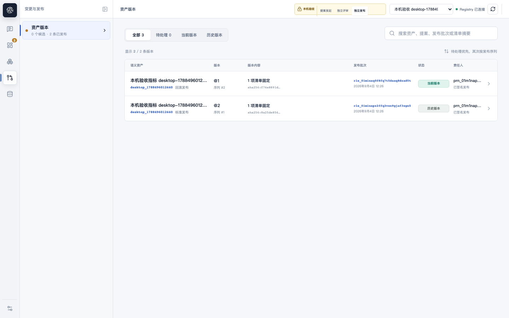
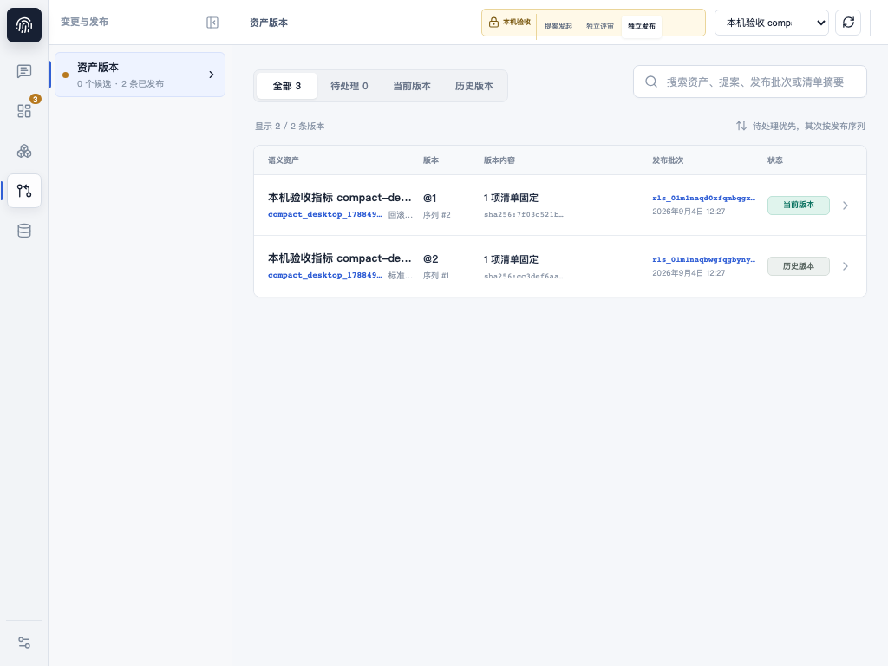

# M2 T011 Acceptance Evidence

## Status

`Local UAT ready`; T011 remains `Running`.

The embedded Web application, Go API, PostgreSQL store, worker validation, independent review,
publish, reload, and rollback journey is available for founder acceptance at the two supported
desktop viewports. This is not an external-user or production-authentication claim.

## Delivered

- Development-only `local-author`, `local-reviewer`, and `local-publisher` identities resolve by
  deterministic seed identity to independent principals. A normal member holding the same role
  cannot be selected by an alias. Missing principals are denied by default, and the aliases are
  rejected outside the Development environment.
- The Web application exposes an explicit local-acceptance identity selector and attaches the
  selected principal to typed SDK requests. Actor changes reload authoritative catalog and
  governance state.
- Human proposal authorship is derived from the authorized principal. Client-supplied authorship
  cannot bypass author/reviewer separation of duty.
- Persisted review facts have a typed read API, so an approval remains visible after actor changes
  and browser reloads.
- The real-stack Playwright suite creates isolated data and proves submit, worker validation,
  independent approval, publish, reload, rollback, and second reload without fixture mode.
- Production fixture boundaries remain explicit: the complete product navigation stays available,
  while the local acceptance claim applies only to the real Catalog and Governance surfaces. API
  failures never fall back to fixture state.

## Acceptance Captures

## Decision

Founder testing can begin against the running local stack. The valid claim is local product UAT,
not real external-user testing.

T011 remains open for:

- an external authentication and session boundary suitable for real users;
- a live configured LLM-provider run through proposal generation;
- hosted acceptance and release evidence when the product enters an external deployment stage.

Local security and release-shaped gates are green. Detailed command evidence is recorded in
`docs/evidence/M2-T011/test-results.md`.
