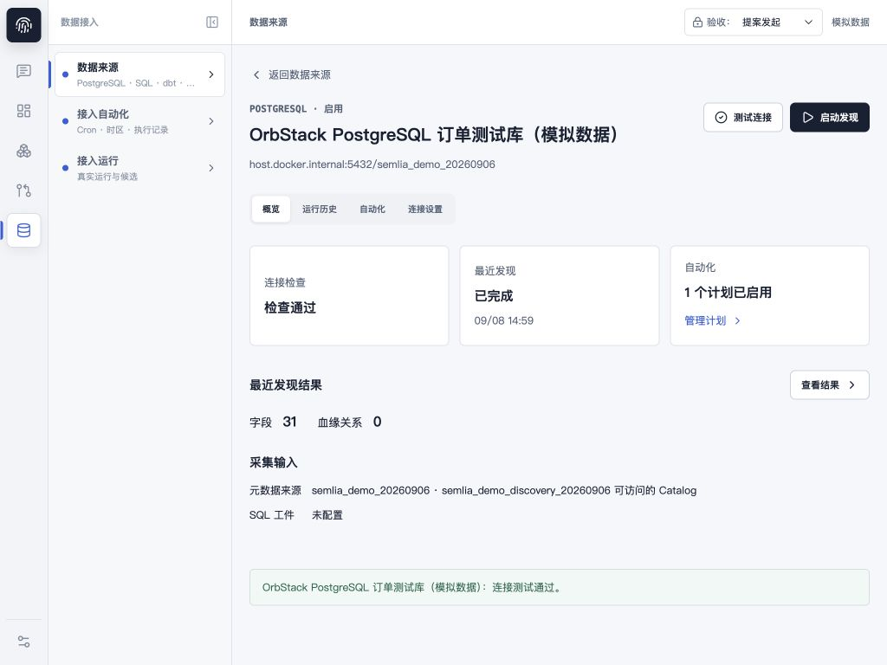
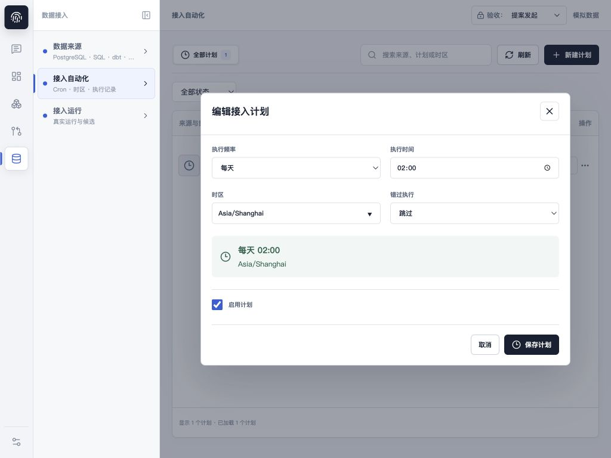
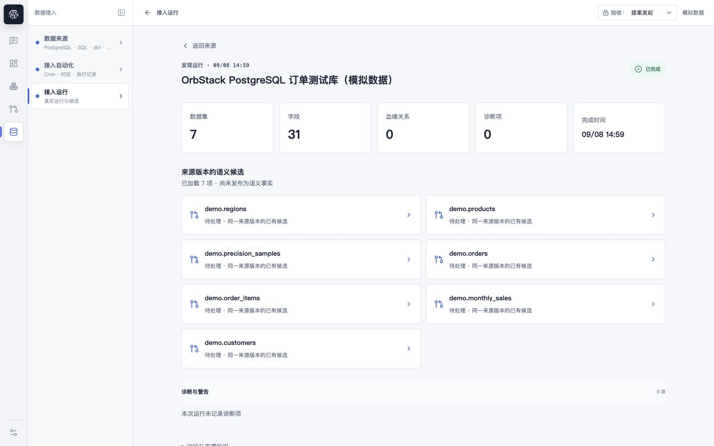
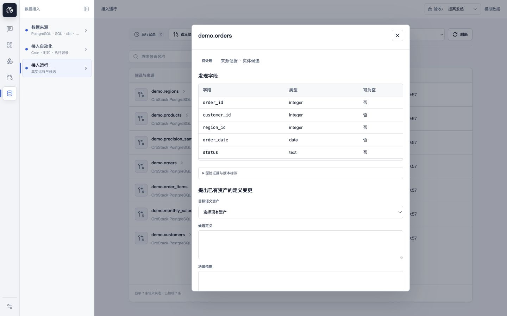

# 数据接入验收复查

复验状态：A1-A4 已完成修复并通过范围验收，详见 [修复与复验记录](fixes.md)。以下保留初次验收的问题与复现证据。

日期：2026-09-08。对象：当前工作区三个数据接入菜单及明细，预览 http://127.0.0.1:18083/ 。结论：暂不通过完整验收；展示与正常读取路径可用，以下四个 P2 问题需要修复。

## 验收问题

### A1 / P2：关闭候选关联失败窗口后可重复创建提案

位置：web/src/LiveSourcesView.tsx:640、648；web/src/governanceRuntime.tsx:397。

场景：提案创建并提交成功，候选关联失败；用户关闭明细，再打开同一候选并提交。preparedProposalId 仅存在于已卸载的弹窗状态中，重开后恢复为空，重新调用 createAndSubmitProposal。后端 CreateProposal 为每次调用生成新 ID，不能依赖候选关联请求的幂等键防止重复提案。

复现：组件故障注入测试预期提案创建一次，实际两次。原有重试测试仅保持弹窗打开，未覆盖关闭/重开。应持久保存或可查询候选处理尝试与提案 ID，并区分提案创建、提交、候选关联三个阶段。

### A2 / P2：计划运行明细不会读取新产生的候选

位置：web/src/LiveSourcesView.tsx:804、835。

场景：页面首次加载时只有历史候选，之后计划触发一个新运行/新来源版本。打开已完成的新运行时只请求 getDiscoveryRun，沿用父级旧 candidates。父级轮询仅跟踪已加载 runs，未必包含新计划运行，因此详情显示“暂无关联候选”，直到退出后刷新。

复现：运行详情接口返回新运行及新来源版本，候选接口已可返回 new.results，组件仍找不到该候选。原有测试只使用首次加载时已经存在的候选。应在打开运行或进入终态时读取该运行/来源版本对应候选，并提供独立加载和失败重试状态。

### A3 / P2：跨菜单切换遗留运行详情，返回文案与目的地不一致

位置：web/src/LiveSourcesView.tsx:376-378；web/src/ProductApp.tsx:2787。

真实浏览器步骤：数据来源 → 来源详情 → 查看结果 → 点击左侧接入运行。菜单和标题变成“接入运行”，主体保留来源内的旧运行详情，按钮仍为“返回来源”。点击该按钮实际打开接入运行中的候选列表，而非来源详情。截图 06-menu-state.png 展示冲突状态。

应将详情及返回上下文纳入明确的导航状态，菜单切换清理或恢复相应域的详情。原有测试只验证不跨菜单的返回操作。

### A4 / P2：计划技术信息无法通过 Tab 到达

位置：web/src/LiveSourcesView.tsx:977-980。

真实浏览器步骤：计划详情关闭按钮 Shift+Tab → 最后一条“打开运行”；再按 Tab → 直接回到关闭按钮，“计划标识与 Cron”的 summary 被跳过。焦点循环选择器遗漏 summary。应覆盖所有可聚焦元素，并排除折叠内容中的隐藏控件。

## 页面检查步骤

1. 数据来源列表 → 概览、连接设置、运行历史：正常读取及只读连接测试通过；跨菜单返回受 A3 影响。
2. 接入自动化列表 → 计划详情、编辑器、执行记录：已有最终运行状态正确，紧凑桌面布局清楚；新运行候选受 A2 影响，技术信息键盘访问受 A4 影响。
3. 接入运行 → 结果详情 → 候选详情：统计、来源版本归因、字段证据和默认未选择资产正确；故障恢复受 A1 影响。

## 本次证据

- 1440x900 与 1024x768 浏览器检查，临时尺寸已恢复。
- 定向测试 38/38 通过：pnpm --dir web test src/LiveSourcesView.test.tsx src/ingestionRuntime.test.tsx src/ingestion.test.tsx。
- 两项新增反例探针均失败：重复提案调用次数 2（期望 1）；新候选按钮未出现。
- 探针源保存在 acceptance-probes.test.tsx.txt；临时测试文件已从 web/src 移除，未修改产品代码。复制到 web/src/ingestionAcceptance.probe.test.tsx 后可使用 pnpm --dir web test src/ingestionAcceptance.probe.test.tsx 复现。
- pnpm --dir web build 通过，主 JS 包约 930 kB，仍有大包警告。
- 未在验收库中创建/删除连接、修改计划、启动发现或提交治理提案；写入故障通过组件 API mock 注入。
- 权限行为由已有定向测试覆盖，未重新执行真实多角色写入矩阵；文件/SQL/dbt 工件主要由已有定向测试覆盖，当前真实浏览器数据仅含 PostgreSQL 来源。
- 本次不宣称全量后端、跨会话灾难恢复、屏幕阅读器或 WCAG 合规验收。扫描范围、来源版本差异、候选新建资产仍为明确未实现范围，不将其混作本次新增回归。

## 截图

来源详情与连接检查（1024x768）：

计划编辑（1024x768）：

菜单与返回上下文冲突（1440x900）：

候选明细（1440x900）：

