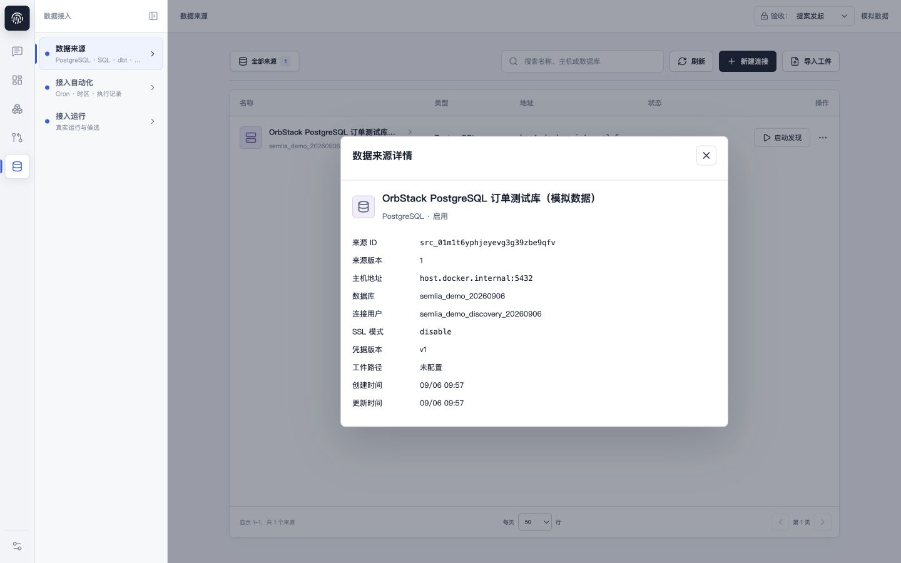
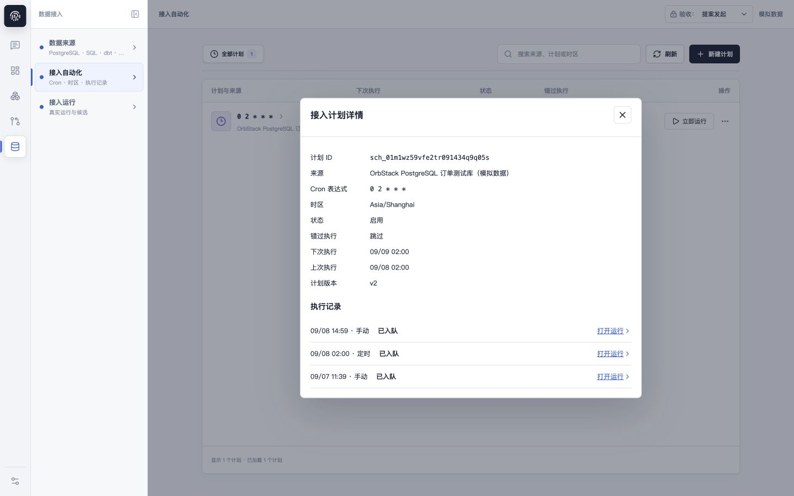
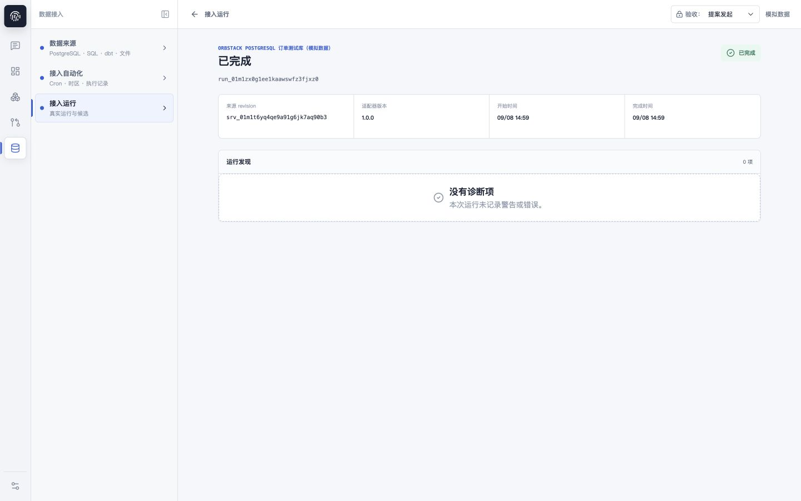
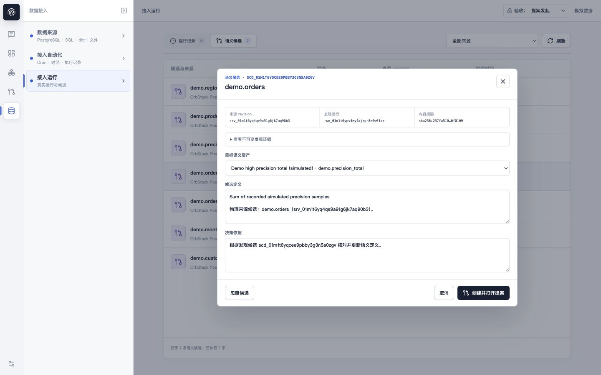

# 数据接入产品体验审查

日期：2026-09-08。范围：数据来源、接入自动化、接入运行及关联详情。

## 结论

三个页面的对象划分可以保留，但当前体验更接近连接、调度、任务三个后台资源管理界面，而不是完成一次语义发现的工作流程。主要问题不是配色，而是来源缺少运营上下文、运行缺少产物解释、候选缺少可靠的治理转化方式。

设计依据：`docs/SSOT.md` 的 J-001/J-002、`docs/specs/product-prototype/product-design.md` 的责任域与 Quiet operational workbench 原则。原型文档用于理解设计意图，不作为当前后端能力清单。

Semlia 是语义资产控制平面，不是搬运业务数据的 ETL 平台。接入成功应以“得到可追溯的发现结果，并明确如何进入治理”为用户结果，而不只是保存连接或任务成功。

## 方法与边界

- 在当前本机页面实际查看 1 个来源、1 个计划、10 次运行、7 个待处理候选。
- 桌面查看尺寸为 1440x900；三个主列表另检查 1024x768。未开展移动端测试。
- 打开连接创建、工件导入、来源详情、计划创建、计划详情、运行详情、候选详情和原始证据，检查更多操作与跨页链接。
- 未创建、修改、暂停、删除来源或计划；未启动发现、上传文件、忽略候选、提交提案或发布。写入副作用与服务端错误恢复不属于本轮已验证结论。
- 页面明确标记“模拟数据”。这不能解释为所有操作只在浏览器内模拟；本轮不作该假设。
- 本轮未运行代码测试，未修改应用代码。代码只用于核对已观察到的流程及其行为边界。
- 浏览器暂时尺寸覆盖已恢复。已有工作区修改保留。

## 流程步骤与证据

| 步骤 | 检查面 | 健康度 | 截图 |
| --- | --- | --- | --- |
| 1 | 来源列表、更多操作 | 部分通顺，无法判断近期接入健康 | 01-sources.png |
| 2 | 来源详情 | 断点，只能查看连接参数 | 02-source-detail.png |
| 3 | 新建连接 | 部分通顺，没有表单内连接测试与采集范围 | 03-create-source.png |
| 4 | 导入工件 | 部分通顺，可选类型明确，后续发现结果不明确 | 04-import.png |
| 5 | 自动化列表、更多操作 | 部分通顺，调度配置主导而非运行健康 | 05-automation.png |
| 6 | 新建计划 | 部分通顺，Cron 与时区直接暴露 | 06-create-plan.png |
| 7 | 计划详情与打开运行 | 明确断点，跳至系统设置；调度状态不代表运行状态 | 07-plan-detail.png；跨页结果由本轮可访问性树验证 |
| 8 | 接入运行列表 | 部分通顺，来源筛选存在，变化与产物归属不明确 | 08-runs.png |
| 9 | 接入运行详情 | 明确断点，诊断代替产物结果 | 09-run-detail.png |
| 10 | 候选列表 | 部分通顺，缺少按运行、状态、类型的任务筛选 | 10-candidates.png |
| 11 | 订单候选处理 | 高风险，默认选中无关资产，缺少新建路径 | 11-candidate-detail.png |
| 12 | 展开不可变证据 | 可追溯但难读，主要为 JSON | 12-evidence.png |
| 13 | 紧凑桌面三个列表 | 无明显相互遮挡，但名称和地址截断明显 | 13-compact-sources.png 至 15-compact-runs.png |

## 优先问题

### P1：候选处理默认指向无关资产，并把物理发现简化为定义文本更新

步骤 11 中打开 `demo.orders`，目标自动选中 `demo.precision_total`，候选定义由该指标原定义与订单来源说明拼接而成。用户尚未判断对应关系，“创建并打开提案”就已可用。

代码核对：`web/src/LiveSourcesView.tsx:582` 默认使用 `assets[0]`；`:601` 起调用 `createAndSubmitProposal`，变更字段固定为 `definition.boundary`。不是基于来源匹配选中的资产。当前 UI 只有选择已有资产，没有从发现结果建立新语义资产的路径。没有已有资产时，该转化流程不能完成。

这不是直接发布错误事实，但会引导用户制造错误关联的治理提案，并增加审核负担。按钮“创建并打开”也未充分表达提交动作。

建议：目标初始不选中；匹配建议必须附理由并由用户确认；区分创建语义资产、关联已有资产、提出已有资产变更、忽略。先展示字段、类型、关系、发现依据及差异，再进入治理草稿。无法支持的新建路径应明确列为能力缺口，不能用任意已有资产替代。

### P1：同一运行有两种详情，自动化跳到另一责任域

步骤 7 的 09/08 14:59 手动执行记录显示“已入队”；点击“打开运行”实际进入 `/operations/runtime?run=run_01m1zx0g1ee1kaawswfz3fjxz0`。详情显示成功，关闭后落在系统设置的审计与运行。

步骤 9 从接入运行进入同一个 ID，则得到另一套全页详情。一个入口展示 Job、Trace、服务端事件；另一个入口展示来源版本、适配器版本、诊断项。用户必须理解内部模块分工才能拼出一次运行。

代码核对：`web/src/LiveSourcesView.tsx:762` 直接使用 `occurrence.operationsPath`，并把非 skipped 的 occurrence 显示为“已入队”。这可能忠实表达调度记录，但不能充当最终执行状态。

建议：所有业务入口进入同一个接入运行详情，保留来源、计划和返回位置；全局运行只作为“技术诊断”入口。计划历史分别展示触发结果和任务最终状态。人工立即运行是否计入“上次执行”需要统一口径；目前详情上次执行 02:00，历史同时存在 14:59 手动执行。

### P1：运行成功后没有回答“发现了什么，下一步做什么”

步骤 8 列表显示 `fields 31`、`lineage 0`；步骤 9 的详情主体却是“运行发现 0 项 / 没有诊断项”。这里的零是诊断项数，不是发现资产数，但标题容易造成相反理解。

详情没有对应字段列表、变化摘要、候选数量、关联候选入口，也不能从来源版本 ID 继续查看快照。十次运行与七个候选之间的归属，需要用户自行对照 ID 和时间。

建议：详情优先展示结果摘要、相对上次的变化、本次新增/复用/待处理候选、采集范围和下一步；诊断独立成区。“无变化”“未产生候选”“存在待处理候选”“发生警告但产物可用”必须区分。统计与关联应由可靠契约提供，不根据本地列表长度推算。

### P2：来源详情是参数弹窗，不是来源工作面

步骤 1 的来源状态仅为“启用”，无法判断是否可连接、最近是否发现成功、是否配置自动化。步骤 2 大量展示 ID、版本、地址和时间，无最近运行、范围、结果或操作。

用户从列表点进来源后，想测试、编辑、运行，必须先关详情回列表。数据来源与接入计划之间没有就地配置路径。

建议：来源详情使用可定位、可返回的全页工作面，按需组织概览、采集范围、自动化、运行历史、连接设置。顶部给出名称、连接检查状态、最近成功发现时间与当前需要处理的事项；测试、发现、编辑在上下文中可达。技术 ID 和凭据版本放在次级信息区。

来源列表优先列名称/类型、连接健康、最近发现、自动化、待处理结果。地址仍可查看，但不应挤压真正的运营判断信息。无需先增加装饰性指标卡。

### P2：新建连接与首次发现之间缺少准备和确认

步骤 3 的表单只能保存连接，没有表单内测试，也没有 schema/表/排除项范围。`版本化 SQL 路径` 出现在数据库连接表单中，但未明确路径属于哪个执行环境、如何获得和校验。

代码核对：`SourceDialog` 创建时调用 `createSource`；列表的 `handleStart` 单独启动发现并显示运行通知。不能说完全没有启动反馈，问题是反馈之前的测试、范围和首次结果闭环没有形成。

建议：数据库接入围绕配置连接、校验权限与可达性、选择范围、首次发现组织；连接对象可以先保存，但不得把“已保存”当作“已就绪”。SQL 工件配置应归到清晰的内容输入或高级设置。编辑连接当前主要修改名称、启停与工件路径，无法修改主机等参数，应清楚区分可编辑配置与需要重建的连接标识。

步骤 4 的文件入口应明确“导入文件”与“上传新版本”的关系，展示文件校验结果、来源版本及后续发现动作。没有上传真实文件，因此本轮不判断校验效果。

### P2：自动化被设计成 Cron 管理，而不是持续发现管理

步骤 5 使用 `0 2 * * *` 作行标题，“错过执行”占独立列，却没有最近执行结果。步骤 6 只有来源、Cron、IANA 时区和错过策略；没有自然语言预览、下几次触发预览，创建表单也不提供显式启停选择。

建议：列表主标识用来源/计划名称，直接展示“每天 02:00，上海时间”、最近结果、下次执行、启停。编辑默认使用频率与时间控件，Cron 保留高级模式；时区可搜索。创建按钮明确是保存草稿还是保存并启用。暂停计划与暂停来源的影响应分别定义，删除前显示受影响的计划和执行边界。

### P2：信息层级偏向机器标识，弱化人类决策

来源与计划页都只有一个“全部”Tab；所有来源行展示凭据版本；候选列表展示来源 revision；详情反复突出 ID、哈希。它们用于审计有价值，但不应压过名称、变化、结果与处理动作。

1440px 下来源名称和地址已截断；1024px 时辨认更困难。问题不是空间不足本身，而是重要字段获得的空间和次要字段相近。纯中性底色、清楚的侧边导航、克制的配色值得保留。表格对批量比较是合适的，不必为了视觉统一改成所有对象都用卡片。

建议：以用户读得懂的来源名、任务目的、中文状态为主，技术原文保留在诊断区。`fields`、`lineage` 等已知统计键映射成用户可读标签，未知诊断原文保持不改写。不要翻译 SQL、表字段名、ID 或来源内容。

## 建议职责与页面顺序

| 页面 | 用户问题 | 主要内容 | 主操作 |
| --- | --- | --- | --- |
| 数据来源 | 接了什么、范围是什么、健康吗 | 来源、检查状态、范围、最近结果、关联计划 | 添加来源、测试连接、运行发现 |
| 接入自动化 | 哪些发现会自动发生、是否正常 | 来源/计划、频率、时区、最近结果、下次时间 | 创建、编辑、暂停/恢复、立即运行 |
| 接入运行 | 本次发生什么变化、需要处理什么 | 触发上下文、结果差异、候选、诊断 | 查看结果、处理候选、修复后重试 |

自动化是可选能力，不是首次接入必经步骤。用户可以先完成一次发现并确认产物，再配置持续发现。

候选保留在接入域作为发现产物；进入治理后复用统一资产版本/提案工作面，不在接入页再建设第二套评审器。全局候选 Tab 可以暂留作为聚合入口，但每个候选必须能回到来源与发现运行。

按用户要求逐页优化时，先重做数据来源及其详情，以它为来源上下文入口；同时把默认误选目标资产列为优先纠正项。随后完成统一运行详情和结果链路，最后完善自动化配置与健康展示。不建议先从颜色、圆角或表格换卡片开始。

## 后续验收场景

1. 空工作区连接只读来源后，可通过清晰路径看到第一批发现结果，并建立首个治理草稿。
2. 已有来源无需重新查找即可测试、调整范围、运行发现和查看自己的历史。
3. 自动化历史与接入运行显示一致的最终状态，关闭详情返回触发入口。
4. 相同内容重复发现明确显示无变化或复用结果，不让用户误以为重复生成或遗漏候选。
5. 错误连接、权限不足、解析失败、部分成功分别展示可执行的恢复路径。
6. 候选不自动关联任意资产；修改已有资产前显示匹配理由与实际差异。
7. 新建计划明确是否启用；暂停、恢复、删除不会隐藏对来源和历史证据的影响。
8. 多来源、多计划、多状态场景可搜索、筛选并保留返回上下文。

## 可访问性限制

已观察到按钮可访问名称、菜单 Escape 关闭、部分关闭操作焦点回到触发按钮以及紧凑桌面可见焦点圈。候选和连接弹窗关闭后的焦点表现并不一致，需系统性检查。

浅灰元数据、小字号、名称截断及仅以技术 ID 标识的运行入口有可读性风险。尚未完成对比度测量、全键盘遍历、读屏器测试、焦点陷阱、缩放及 reduced-motion 验收，不宣称无障碍合规。

## 关键截图

