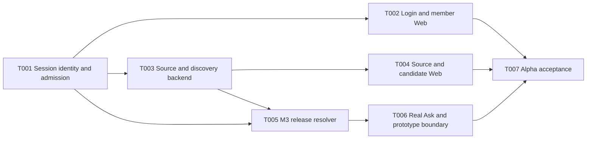

# Controlled-User Alpha Technical Plan

## Metadata

| Field | Value |
| --- | --- |
| Version | 0.1.0 |
| Status | Confirmed |
| Requirements | `docs/specs/alpha-controlled-user/spec.md` 0.1.0 Confirmed |
| Technical decisions | `docs/specs/alpha-controlled-user/technology-decision-record.md` 0.1.0 Confirmed |
| M3 contract | `docs/specs/m3-headless-semantic-distribution/spec.md` and `plan.md` 0.1.0 Confirmed |
| Work graph | `docs/specs/alpha-controlled-user/tasks.md` |
| Last updated | 2026-09-04 |
| Execution authorization | Founder approved continuous T001-T007 execution on 2026-09-04 |

## Delivery Outcome

The plan turns the current locally testable M1/M2 product into Controlled-User Alpha 0.1.0 for 5 to
10 invited users. The accepted user journey is:

```text
OIDC sign-in
-> active workspace membership
-> encrypted read-only PostgreSQL source
-> asynchronous discovery and persisted candidates
-> governed proposal, validation, independent review, publish and rollback
-> release-bound SemanticQuery or Ask
-> validated ResolvedSemanticPlan or explicit refusal
```

Completion means the Alpha profile is ready for controlled user testing. It does not mean the full
M3 milestone, M4 Continuous Governance or M5 Open Ecosystem is complete.

## Delivery Strategy

The implementation follows the authority boundaries in dependency order. Authentication lands
before any new user-facing write path. Source secrets and job orchestration land before the Source
screen is connected. Release projection and deterministic resolution land before Ask can call a
model. The final task tests one integrated flow and records the evidence needed to close M2/T011 and
recommend Alpha acceptance.



The diagram prunes transitive edges. `tasks.md` is authoritative for dependencies and status.

## Work Units

| Task | Outcome | Primary proof |
| --- | --- | --- |
| T001 | OIDC, opaque sessions, memberships, invitations, bootstrap and request-context identity | local OIDC integration, replay/expiry/revocation/CSRF/header-spoof tests, populated migration |
| T002 | Real sign-in/session shell and member administration | two-user browser flow, workspace isolation, keyboard and viewport checks |
| T003 | Encrypted PostgreSQL source, connection test, leased discovery and persisted candidates | real PostgreSQL fixture, secret redaction, retry/restart/idempotency and migration tests |
| T004 | Source setup, run inspection and candidate-to-proposal on real APIs | browser source-to-proposal journey at both desktop viewports |
| T005 | Consumers/bindings, SemanticQuery, release snapshot, plan validation and refusal | deterministic digests, release pinning, ambiguity/join/grain/auth denial and 10,000-asset benchmark |
| T006 | Real Ask interpretation, plan/refusal UX and complete prototype disclosure | live provider plus invalid/provider-down tests; no fixture fallback or fabricated values |
| T007 | End-to-end Alpha hardening and M2/T011 closeout evidence | OIDC-to-rollback-to-query journey, recovery, security, release and independent review gates |

## Implementation Detail

### T001 Identity boundary

Add OpenAPI contracts first for sign-in discovery, session, logout, invitation and membership
administration. Add UUIDv7/TypeID identities and the identity/session migration. Implement provider
discovery and callback behind ports so a local standards-compliant issuer can exercise the full
flow. Compose a single middleware before catalog/governance/source/query routing. Session mode
ignores `X-Semlia-Principal`; explicit development local-UAT mode preserves the current selector.

Workspace listing becomes membership-filtered. The existing unauthenticated workspace bootstrap
write is disabled in session mode and replaced by an idempotent CLI bootstrap command. Session and
membership changes continue to use the existing authorization action vocabulary and decision audit.

### T002 Web session and membership

Introduce one session runtime used by the shell, API client and workspace switcher. The initial
screen is the actual sign-in state, not a landing page. After callback, the shell loads session,
workspaces and capabilities before rendering navigation. `401` returns to sign-in; `403` refreshes
capabilities and explains the denial without losing unrelated view state.

The existing Settings member surface becomes real for list, invite, suspend and revoke. It prevents
final-admin removal and keeps later access-control editing interactions marked as prototype when no
backend command exists. Local UAT retains the three deterministic actors only in development mode.

### T003 Source, credential and discovery backend

Extend the OpenAPI contract with source list/create/detail/update/test/rotate/disable, run start/list/
detail and candidate list/detail/decision endpoints. Add the source/discovery migration and sqlc
queries. The credential encryption port accepts plaintext only at the handler-to-application call,
zeros or discards it promptly, and never places it in domain events or returned errors.

Implement the live catalog collector, physical key and Join observations, allowlisted versioned SQL reader and existing parser merge.
Refactor discovery persistence so start-run creates a queued run and job atomically and the worker
completes that exact run. Successful/degraded snapshots atomically update physical revisions,
evidence and candidates; failures leave the prior projection current.

### T004 Source and candidate Web

Replace `SourcesView` database connections, discovery timers, runs and candidate result fixtures with
the generated client and query state. Preserve the accepted high-density Source workspace while
showing real queued/running/degraded/failed/succeeded states and retryable diagnostics. Credential
fields are write-only and rotation never pre-fills a secret.

Connect candidate conversion to the existing M2 proposal workbench. Other file/import/build-task
features stay visible with a consistent Prototype boundary, session-only behavior and no persisted-
success toast.

### T005 M3 resolver

Confirm the M3 spec in the same approval as this plan, then add its Alpha contracts and distribution
migration. Implement consumer and binding commands, a release snapshot repository, deterministic
candidate selection, a typed validator registry, immutable queries/plans/refusals, and attribution
events. Direct resolution is authorized by `semantic.resolve`; binding management uses the existing
binding actions and execution remains a separate unused capability.

Resolution fixes the release before search. Query and plan canonicalization use deterministic JSON
and recorded resolver/validator versions. A blocker writes a refusal and no plan. Current and pinned
binding behavior is verified across publish and rollback.

### T006 Ask and product honesty

Add a schema-constrained Ask interpreter on the existing model-provider boundary. It records an
agent run but not raw prompt text. Valid output invokes the T005 service; the Web renders released
definition/evidence summaries, selected assets, joins, validation and release, or the exact refusal
and clarification. Data intents show `not_configured` execution and never show a numerical result.

Audit all primary navigation routes. Pages outside the Alpha real scope get the same visible
Prototype marker and cannot imply remote persistence. Delete production fixture fallback paths for
session, sources, discovery, candidates and Ask.

### T007 Acceptance and release evidence

Run the complete authenticated flow using a local OIDC issuer, a read-only PostgreSQL sample and
versioned SQL artifacts. Repeat provider generation against the configured live OpenAI-compatible
endpoint when credentials are available. Exercise process/database restart, session revocation,
credential rotation, discovery retry, publish, rollback, current/pinned resolution and refusal.

Run source, smoke, security, release, migration and desktop E2E gates. Record exact image digests,
migration version, browser viewports, release IDs, query/plan digests and redacted trace IDs. Update
M2/T011 to `Needs_Review` only when its remaining live-provider and external-identity evidence passes;
founder acceptance remains explicit.

## Expected Change Surface

- `api/openapi/**`, generated Go contracts and `sdk/typescript/**`
- `migrations/**`, `db/queries/**`, `internal/adapters/postgres/**`
- `internal/domain/{identity,source,distribution}/**`
- `internal/application/{identity,source,discovery,distribution}/**`
- `internal/adapters/{oidc,discovery}/**`
- `internal/platform/{config,http}/**`, `cmd/semlia/**`, `compose.yaml`
- `web/src/**`, `web/e2e/**`, `web/e2e-live/**`
- `tests/integration/**`, `docs/operations/**`, `docs/evidence/**`

Existing M1/M2 contracts are extended rather than replaced. The current dirty M2/T011 work remains
in place and is not reverted or restyled outside Alpha needs.

## Four-To-Seven-Day Execution Window

| Day | Planned focus | Exit signal |
| --- | --- | --- |
| 1 | T001 backend identity/session/admission | local OIDC and security integration suite passes |
| 2 | T002 Web auth/members; begin T003 source schema and secret boundary | authenticated shell and member commands work |
| 3 | Complete T003 source collection, jobs and candidates | real source-to-candidate integration passes |
| 4 | T004 Source Web; begin T005 release resolver | browser source-to-proposal works |
| 5 | Complete T005 resolver; T006 Ask | direct query and real Ask plan/refusal work |
| 6 | T007 recovery, security, performance and desktop E2E | all automated gates pass |
| 7 | Contingency for provider/source compatibility and founder UAT fixes | evidence is reviewable and Alpha is ready for acceptance |

This estimate assumes one focused implementation stream, immediate reviews, available local test
fixtures, and no work from the Non-Goals. Hosted OIDC/provider credentials and the founder's sample
source can move hosted evidence to Day 7 but do not block local standards-based verification.

## Validation Matrix

| Requirement group | Required evidence |
| --- | --- |
| FR-001 through FR-004 | real OIDC test issuer, state/nonce/PKCE replay tests, membership isolation, revocation and final-admin denial |
| FR-005 through FR-006 | real read-only PostgreSQL fixture, encrypted-at-rest assertion, log/audit redaction, async states, retry and restart |
| FR-007 | configured live provider generation plus provider-down and invalid-schema evidence |
| FR-008 through FR-010 | release-bound query/plan digests, ambiguity/join/grain/binding cases and real Ask browser journey |
| FR-011 | route inventory proving real or visibly Prototype, with no fake persisted-success state |
| FR-012 | populated up/down/up migration, restart recovery, trace/audit attribution and release bundle |
| NFR-001 | dependency, source, secret and image scans with zero unaccepted High/Critical findings |
| NFR-003 | session and 10,000-asset deterministic resolution p95 below 1 second on reference stack |
| NFR-004 | axe, keyboard, visible focus and screenshots at 1440x900 and 1024x768 |

## Standard Gates

- `make check-source`
- `make check-smoke`
- `make security-check`
- `make release`
- generated OpenAPI/sqlc/TypeScript drift checks
- real PostgreSQL empty and populated migration lifecycle
- `pnpm --dir web test`, typecheck, build and fixture/live Playwright suites
- `git diff --check`

Each task produces `docs/evidence/ALPHA-T0NN/summary.md` before it can enter `Needs_Review`.

## Execution Gate

The founder confirmed the TDR, M3 Alpha specification, this plan and `tasks.md` on 2026-09-04.
That approval authorizes continuous execution through T007
without per-task approval pauses. Each next packet remains sequential and can enter `Ready` only
after its dependencies are at least `Needs_Review` with all scoped evidence passing; founder task
and milestone acceptance remain separate.
