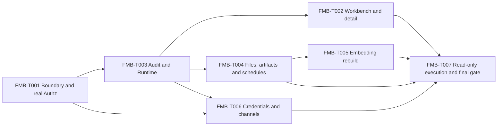

# Full-Menu Beta 0.2.0 Technical Plan

## Metadata

| Field | Value |
| --- | --- |
| Version | 0.2.0 |
| Status | Confirmed |
| Requirements | `docs/specs/full-menu-beta/spec.md` 0.2.0 Confirmed |
| Technical decisions | `docs/specs/full-menu-beta/technology-decision-record.md` 0.2.0 Confirmed |
| Data model and analysis | `docs/specs/full-menu-beta/data-model.md` and `analysis.md` 0.2.0 Confirmed |
| Delivery foundations | Controlled-User Alpha 0.1.0 and M3 Headless Semantic Distribution 0.1.0 |
| Work graph | `docs/specs/full-menu-beta/tasks.md` 0.2.0 Confirmed |
| Last updated | 2026-09-04 |
| Review | Founder approved Full-Menu Beta 0.2.0 and continuous FMB-T001 through FMB-T007 execution on 2026-09-04 |

## Delivery Outcome

Full-Menu Beta 0.2.0 makes the complete supported desktop navigation a truthful, durable product
surface. Every visible command that reports success is backed by a versioned server contract and
durable state. Deployment-managed or unavailable capabilities remain visible only as explicit
read-only status; fixture data and session-only success do not appear in the production runtime.

The accepted end-to-end journey is:

```text
OIDC sign-in and workspace admission
-> server-authoritative roles, assignments and effective-access inspection
-> real workbench, asset and immutable release detail
-> audit, runtime and asynchronous run inspection
-> database, uploaded file, versioned SQL and dbt ingestion with schedules
-> durable embedding-index rebuild and atomic activation
-> machine credential, REST, MCP, CLI, webhook and TypeScript SDK consumption
-> validated plan executed through one bounded read-only PostgreSQL adapter
-> hosted Beta security, recovery, desktop and release gates
```

Completion means a controlled, single-instance hosted Beta is ready for invited users and machine
consumers. It does not claim public self-service signup, arbitrary SQL execution, high availability,
multi-region operation, Kubernetes/Helm support, SCIM, a Python SDK, or unrestricted webhook and
connector ecosystems.

## Requirements Crosswalk

| ID | Required outcome |
| --- | --- |
| FR-001, FR-002 | Truthful production state and persisted authorization administration. |
| FR-003, FR-004 | Authoritative asset/release detail and durable Workbench attention items. |
| FR-005 | Redacted Audit reads/exports and normalized Runtime projection/settings. |
| FR-006, FR-007 | Bounded ingestion/scheduling and durable pgvector rebuild with active-index retrieval. |
| FR-008 through FR-010 | Machine credentials, channel parity and signed webhook delivery. |
| FR-011, FR-012 | Controlled PostgreSQL execution and real hosted release proof. |
| NFR-001 through NFR-005 | Security/privacy, reliability, performance, observability and desktop accessibility. |

## Baseline Audit And Resolutions

The pre-execution audit is complete and carries these blocking resolutions into T001:

1. Access Control uses fixture roles, assignments and client-side evaluation. T001 replaces this
   authority path before another menu gains privileged commands.
2. Workbench, Audit/Runtime and Integrations contain static objects or success paths. T002, T003 and
   T006 replace them with canonical projections and APIs.
3. File ingestion, schedules and embedding rebuild are page-level simulations. T004 and T005 own
   their storage, job and failure contracts.
4. The Alpha outbox marks an event published after one publisher and cannot represent delivery to
   multiple webhook subscribers. T006 adds subscription and per-recipient delivery state instead of
   treating an outbox row as the delivery ledger.
5. Query execution is separate from resolution. T007 accepts only a stored, validated plan and
   never accepts raw or model-authored SQL.
6. The repository has substantial Alpha/M3 work in progress. Every execution attempt preserves
   those changes, records its own changed files and stops on active same-file ownership conflicts.

No unresolved Critical or High planning finding remains. The approved scope deliberately includes
uploaded files, embedding rebuild, machine channels, webhooks and the controlled execution adapter;
their security and durability constraints are mandatory rather than optional follow-up work.

## Technical Decisions

### FMB-D001 One additive REST contract

`/api/v1` remains the only REST major version. Full-Menu Beta publishes OpenAPI
`info.version: 0.9.0` with `x-semlia-contract-version: 9`. All FMB fields and operations are additive;
renames, removals and response-shape reinterpretation require a later major contract. Generated Go
and TypeScript artifacts are committed and checked after every contract edit.

### FMB-D002 Server-authoritative authorization

Actions remain the authorization identifiers. System roles remain immutable. Custom roles are
workspace-scoped and use immutable role versions; editing creates a new version and atomically
advances the role pointer. Assignments record scope, grantor, start, optional expiry and revocation.
Every privilege mutation enforces human-only actions, separation of duties, authorization ceilings,
final-administrator safety, optimistic version checks and immutable audit. Effective-access
inspection calls the same server evaluator used by protected commands.

### FMB-D003 Projection-first operational screens

Workbench persists a narrow `attention_items` projection over proposals, reviews, validation,
discovery, runtime failures and compatibility state without adding M4 autonomous actions. Asset and
release detail use stable revision and manifest identities. Operations presents canonical run kinds
through one discriminated read contract while each domain retains ownership of its write model.

Workspace future-run defaults and run-metadata retention are versioned, allowlisted runtime
policies. Audit retention, worker concurrency, OTel endpoints, database URLs and encryption keys
remain deployment configuration and are rendered read-only.

### FMB-D004 Bounded file and artifact ingestion

Browser upload accepts CSV, XLSX and Markdown only. The server checks extension, magic bytes,
declared MIME, expanded archive size, row/cell/document limits and content digest; it rejects macros,
encrypted workbooks, active content, path traversal and decompression bombs. Files pass through a
shared `ArtifactStore` port, are content-addressed by SHA-256 and referenced by database metadata.
Local deployment uses a shared durable volume and hosted deployment uses the S3-compatible adapter
defined by FMB-TDR-005; a server-local temporary path is never authoritative. Upload and parser
limits use the constants in FMB-TDR-005, and any workbook formula or active content rejects input.

Versioned SQL remains relative to the configured artifact root. dbt ingestion accepts an explicitly
supported `manifest.json` plus optional `catalog.json` pair and rejects unsupported schema versions.
All inputs enter the existing discovery/candidate pipeline and preserve source evidence.

Schedules use a five-field cron expression plus IANA timezone. A scheduler claims due rows with
database locking and enqueues existing ingestion jobs using schedule, occurrence and source in the
idempotency key. Overlap, disabled sources, DST transitions, restart and missed-occurrence policy are
persisted and tested.
Spring-forward gaps are skipped; fall-back repeated wall minutes run once at the earlier offset.
Overlap is skipped rather than delayed. Schedule creation delegates future execution to the system
actor, while every occurrence still requires an enabled source and a usable pinned credential.

### FMB-D005 Immutable embedding generations

PostgreSQL with pgvector stores vector rows keyed by workspace, generation, knowledge block and
source revision. One active model and exact dimension apply to a generation. Rebuild scans a stable
corpus snapshot, batches provider calls, persists progress and checksums, validates coverage and
dimension, then atomically advances the active-generation pointer. Failure or cancellation leaves
the prior generation active. Provider credentials remain environment references.

The active generation supplies bounded semantic candidate recall for Ask and catalog search. The
existing deterministic resolver still selects and validates released assets; vector score alone
never authorizes, publishes or executes a candidate.

### FMB-D006 One application service across delivery channels

REST, MCP, CLI and the TypeScript SDK call the canonical distribution and authorization application
services. Machine credentials belong to a persisted consumer and server-owned machine principal,
store only a lookup prefix and keyed digest, return plaintext once, and support expiry, rotation and
revocation. Credential actions can only narrow that principal's current grants.

MCP exposes an allowlisted resource/tool surface for released semantics, resolve, plan/refusal
inspection and controlled execution. CLI provides the same operations with stable JSON output and
exit codes. Neither channel reaches PostgreSQL repositories directly.

Webhook subscriptions use an event allowlist, HTTPS outside development, HMAC signatures with
timestamp and delivery ID, encrypted signing-secret envelopes with one-time display and rotation,
DNS/IP revalidation, bounded bodies and per-subscription delivery rows. Retry is leased with capped
exponential backoff and a terminal dead-letter state.
Private, loopback, link-local and metadata-service destinations fail SSRF validation.

### FMB-D007 Controlled PostgreSQL execution

Execution accepts a persisted `ResolvedSemanticPlan` and an active source binding. The adapter
produces parameterized SQL from typed plan nodes, opens a read-only transaction under a read-only
database role, applies statement timeout, row, byte and concurrency limits, and supports
cancellation. One statement is permitted; DDL, DML, comments, stacked statements, arbitrary
expressions and client SQL are absent from the public contract.

Execution persists identity, plan/release/source/model versions, SQL digest, timing, row count,
truncation, outcome and redacted error code. Raw result rows stream to the authorized caller and are
not stored in audit, usage, job or webhook payloads.

### FMB-D008 Hosted proof cannot be simulated

Local standards-based OIDC, TLS termination, model/provider stubs and webhook receivers prove
deterministic behavior. Hosted acceptance additionally requires founder-supplied or deployment-
supplied OIDC issuer/client registration, a real HTTPS hostname/certificate, live model and
embedding credentials, a read-only PostgreSQL source, and an external HTTPS webhook receiver.
Missing external inputs block only the corresponding hosted gate and are recorded as missing; local
stubs or fabricated screenshots never satisfy that evidence. Hosted proof also requires a real
OpenTelemetry endpoint and a backup/restore rehearsal.

## API Surface

The plan reserves these additive operation groups; exact schema names are generated from the
OpenAPI source and stay within contract version 9:

- `/api/v1/workspaces/{workspaceId}/authorization/roles`
- `/api/v1/workspaces/{workspaceId}/authorization/role-bindings`
- `/api/v1/workspaces/{workspaceId}/authorization:inspect`
- `/api/v1/workspaces/{workspaceId}/workbench/items`
- `/api/v1/workspaces/{workspaceId}/operations/audit-events`
- `/api/v1/workspaces/{workspaceId}/operations/runs`
- `/api/v1/workspaces/{workspaceId}/runtime-policy`
- `/api/v1/workspaces/{workspaceId}/file-sources` and upload/finalize operations
- `/api/v1/workspaces/{workspaceId}/ingestion-schedules`
- `/api/v1/workspaces/{workspaceId}/embedding-indexes` and `:rebuild`
- `/api/v1/workspaces/{workspaceId}/api-clients` and credential lifecycle operations
- `/api/v1/workspaces/{workspaceId}/webhook-subscriptions` and delivery inspection
- `/api/v1/workspaces/{workspaceId}/resolved-semantic-plans/{planId}:execute`
- `/api/v1/workspaces/{workspaceId}/query-executions/{executionId}` and cancellation

Every list is cursor-paged and bounded. Every mutation accepts an idempotency key and, where state
can race, an expected version. Error envelopes retain stable machine-readable reason codes.

## Migration Ledger

Migration numbers and ownership are fixed to prevent parallel tasks from racing schema history:

| Migration | Owner | Schema responsibility |
| --- | --- | --- |
| `000016_fmb_authorization_admin` | FMB-T001 | Workspace custom role versions, active role pointers, assignment expiry/revocation and supporting constraints/indexes |
| `000017_fmb_operations_runtime` | FMB-T003 | Runtime policy, operational runs/events, attention-item storage contract and audit/run query indexes |
| `000018_fmb_file_ingestion_schedules` | FMB-T004 | File blob/source metadata, artifact registrations, schedules, occurrences and ingestion-run links |
| `000019_fmb_embedding_index` | FMB-T005 | pgvector enablement, corpus snapshots, immutable index generations, vector rows and active pointers |
| `000020_fmb_distribution_interfaces` | FMB-T006 | Machine principals/credentials, webhook subscriptions, per-recipient deliveries and secret rotation metadata |
| `000021_fmb_query_execution` | FMB-T007 | Query execution records, cancellation and bounded result/provenance metadata |

Each owner supplies `.up.sql` and `.down.sql`, populated up/down/up evidence, generated sqlc output
and readiness-version updates. Historical migrations are immutable. T002 is projection-only and
does not own a migration. The final expected schema version is 21.

## Work Graph



`tasks.md` is authoritative for status and dependency details. Contract generation, sqlc output,
shared HTTP routing, worker registration and `ProductApp.tsx` are serialized integration zones even
when domain design or isolated tests can be prepared concurrently.

## Requirements And Gate Checklist

The confirmed specification, planning analysis and implementation checklist establish that:

- Each visible menu and success-producing command maps to FR-001 through FR-012.
- Authentication, authorization, secrets, cross-workspace behavior and separation of duties have
  explicit failure criteria.
- Uploaded file trust, webhook SSRF/signing, vector activation and execution limits have explicit
  security boundaries.
- Empty, queued, running, degraded, failed, canceled, expired, revoked and unavailable states are
  represented where relevant.
- Migration ownership, rollback evidence, API compatibility and generated artifact drift are
  assigned to tasks.
- Desktop accessibility and the 1440x900 and 1024x768 viewports are acceptance requirements.
- Hosted external inputs are named and cannot be replaced with fixtures.
- No unresolved placeholder, Critical finding or High finding remains in this plan.

## Standard Validation Gates

Every task runs its focused tests plus the applicable shared gates:

- `make contracts-check`
- `make db-generate-check`
- `pnpm --dir web lint`
- `pnpm --dir web typecheck`
- `pnpm --dir web test`
- `make check-source`
- `git diff --check`

FMB-T007 additionally requires:

- `make check-smoke`
- `make security-check`
- `make release`
- empty and populated migration 15-to-21 upgrade and 21 down/up recovery
- process, worker and PostgreSQL restart/recovery journeys
- credential expiry/revocation/rotation, webhook retry/dead-letter and SSRF evidence
- embedding generation failure/cancel/atomic switch evidence
- execution timeout/cancel/row-limit/read-only/cross-workspace evidence
- deterministic and live desktop E2E at 1440x900 and 1024x768
- release checksums, SBOM, provenance and redacted trace/evidence inventory

## Execution And Acceptance Gate

Founder approval of this plan and `tasks.md` authorizes continuous delegated execution through
FMB-T007 without per-task approval pauses. FMB-T001 is Ready because its execution packet is present.
A later task may enter Ready when its dependencies are `Needs_Review` or `Accepted`, its packet is
self-contained and its scoped evidence gates are available.

Workers do not mark tasks Accepted. The orchestrator performs specification, engineering-quality
and QA review, records evidence, and advances passing tasks to `Needs_Review`. Full-Menu Beta 0.2.0
is not reported complete until FMB-T007 passes all available gates and records any missing hosted
external input without substitution.
