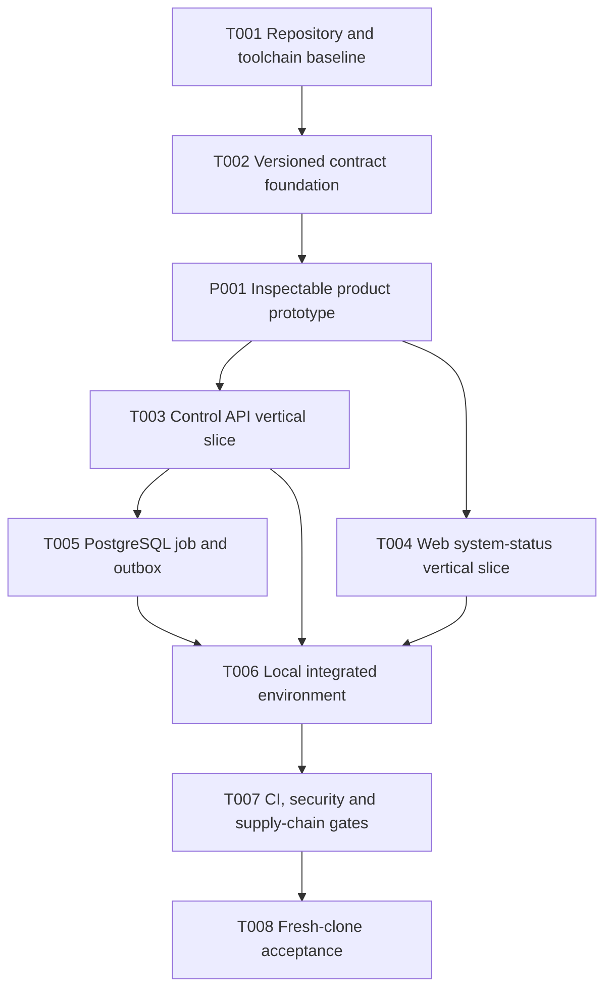

# M0 Foundation Work Graph

## 元数据

| 字段 | 值 |
| --- | --- |
| Feature | m0-foundation |
| 版本 | 0.10.0 |
| 状态 | Confirmed |
| 最后更新 | 2026-08-13 |
| Source | `docs/SSOT.md`, `docs/specs/m0-foundation/plan.md` |
| TDR | `docs/adr/0001-m0-technical-foundation.md` |

## 1. 状态定义

- `Draft`：task 已具备审核信息，但工作图尚未获得用户确认。
- `Ready`：依赖满足、checklist 和 analysis 完成、execution packet 已生成。
- `Running`：一个执行 attempt 或其必需的规格、质量与 QA 独立评审正在进行。
- `Needs_Review`：实现、证据和三轮独立评审均已通过，等待创始人验收。
- `Accepted`：评审通过且用户明确接受。
- `Blocked`：依赖、环境或需求问题阻止推进。

任何 task 在本文档变为 `Confirmed` 前都保持 `Draft`。任务执行前还必须完成 requirements checklist、一致性 analysis 和独立 execution packet。

## 2. 工作图

可并行边界：

- P001 是隔离的产品评审路径，不成为生产 Web 或 API 实现；创始人接受核心旅程后继续 T003、T004。
- T003 与 T004 在 P001 完成后可以并行，文件所有权不重叠。
- T005 可与 T004 并行，但依赖 T003 提供应用配置和数据库连接边界。
- T007 可以在 T001 后开始工作流骨架，但最终门禁依赖 T002 至 T006 的验证命令。

## 3. Epic 与 Story

### Epic E001 Repository Foundation

Goal:

交付可运行、可迁移、可观察的 Semlia 模块化单体基础。

Stories:

- M0-US-001 新贡献者启动项目。
- M0-US-002 客户端调用控制面。
- M0-US-003 维护者安全演进数据库。
- M0-US-004 后台任务可靠运行。

Tasks:

- [x] P001 [Product Review] 建立可检查的产品原型
- [x] T001 [M0-US-001] 建立仓库与工具链基线
- [x] T002 [M0-US-002] 建立版本化公共契约
- [x] T003 [M0-US-002] 实现控制面 API 纵向基础
- [x] T004 [P] [M0-US-002] 实现 Web system-status 纵向基础
- [x] T005 [M0-US-003, M0-US-004] 实现 PostgreSQL 迁移、job 与 outbox
- [x] T006 [M0-US-001] 组装本地完整运行环境

### Epic E002 Quality and Distribution

Goal:

让任何变更都能在本地和 CI 获得一致证据，并让全新贡献者完成可复现验收。

Stories:

- M0-US-005 贡献变更获得可信反馈。
- M0-US-001 新贡献者启动项目。

Tasks:

- [x] T007 [M0-US-005] 建立 CI、安全与供应链门禁
- [x] T008 [M0-US-001, M0-US-005] 完成 fresh-clone 验收与 M0 交付证据

## 4. Task Details

### P001 建立可检查的产品原型

Status: Accepted
Priority: P0
Depends on: T001, T002
Blocks: T003, T004 product review ordering
Story / Requirement: SSOT sections 5, 6, 7, 8, 17 and 18
Parallel: No
Conflicts with: Production `web/**` and API behavior remain outside this task

Goal:

交付一个明确使用 mock data 的独立可点击原型，让创始人直接检查语义资产发现、详情、提案审核、release 和消费者绑定旅程，并据此确认后续产品实现方向。

Allowed files:

- `prototypes/product/**`
- `package.json`
- `pnpm-workspace.yaml`
- `pnpm-lock.yaml`
- `pnpm-workspace.yaml`
- `Makefile`
- `docs/specs/product-prototype/**`
- `docs/evidence/P001/**`
- `docs/specs/m0-foundation/plan.md`
- `docs/specs/m0-foundation/tasks.md`
- `docs/specs/m0-foundation/analysis.md`
- `docs/specs/m0-foundation/checklists/requirements.md`

Test targets:

- `prototypes/product/src/**/*.test.tsx`
- `prototypes/product/e2e/**/*.spec.ts`

Deliverables:

- 产品原型 design contract、页面与状态清单。
- Sources、Overview、Assets、Proposals、Releases 和 Consumers 可点击视图。
- 资产 master-detail、关系图、证据、结构化 diff、验证结果和 release binding。
- 普通桌面与紧凑桌面视觉证据。

Acceptance criteria:

- 首屏直接展示语义资产控制工作，不是营销页或聊天页。
- 所有 mock data 和本地模拟动作持续、明确标识，不产生真实写入错觉。
- 用户可以完成接入来源、运行 discovery、查找资产、创建或打开提案、查看 diff 与验证、模拟审核、形成 candidate、模拟发布或回滚、创建消费 binding 和处理反馈信号的完整路径。
- 主要导航、筛选、tabs、drawer/dialog 和关键操作支持键盘与可见焦点。
- 1440x900 与 1024x768 无文本溢出、控件遮挡或不可达操作。

Definition of Done:

- lint、typecheck、unit test、build 和 Playwright 主路径通过。
- 设计 review 和 desktop/compact-desktop screenshot evidence 存在。
- 用户接受后才能把原型决策转入生产 Web 或 M1 specification。

Validation commands:

- `pnpm --filter @semlia/product-prototype lint`
- `pnpm --filter @semlia/product-prototype typecheck`
- `pnpm --filter @semlia/product-prototype test`
- `pnpm --filter @semlia/product-prototype build`
- `pnpm --filter @semlia/product-prototype test:e2e`
- `git diff --check`

TDD plan:

- RED: 为 mock 标识、核心导航、资产筛选和提案审核路径编写失败测试。
- GREEN: 实现最小多视图原型和真实交互状态。
- REFACTOR: 对照 design contract 完成响应式、可访问性、视觉和 reduced-motion QA。

Packet path:

- `docs/specs/product-prototype/packets/P001-A004.yaml`

Evidence required:

- Changed files、RED/GREEN results 和 browser interaction results。
- Desktop/compact-desktop screenshots、design rubric 和 accessibility results。
- Diff summary、mock boundary 和 residual risks。

Acceptance:

- Founder accepted the product direction and technical selection on 2026-08-10.
- Review is founder-direct; no Figma review board or multi-reviewer workflow is required.
- P001 no longer blocks the execution ordering of T003 and T004.

### T001 建立仓库与工具链基线

Status: Accepted
Priority: P0
Depends on: None
Blocks: T002, T003, T004, T005, T006, T007, T008
Story / Requirement: M0-US-001, M0-FR-001, M0-FR-008, M0-NFR-003
Parallel: No
Conflicts with: None

Goal:

建立受版本约束的 Go module 与 TypeScript workspace、统一根命令和完整开源仓库治理，使后续任务不再自行发明工具入口。

Allowed files:

- `README.md`
- `LICENSE`
- `NOTICE`
- `.gitignore`
- `.editorconfig`
- `.tool-versions`
- `go.mod`
- `package.json`
- `pnpm-workspace.yaml`
- `pnpm-lock.yaml`
- `Makefile`
- `CONTRIBUTING.md`
- `CODE_OF_CONDUCT.md`
- `SECURITY.md`
- `scripts/doctor.sh`
- `tests/repository/repository_contract_test.go`

Test targets:

- `tests/repository/repository_contract_test.go`

Deliverables:

- Go 1.26 与 Node.js 24 LTS 兼容性探针。
- Go module 和 pnpm workspace 根配置。
- `make bootstrap`、`make doctor`、`make clean`。
- Apache 2.0 LICENSE、NOTICE、贡献和安全文档。

Acceptance criteria:

- `make doctor` 检查必需工具、版本、端口和 Docker 能力，并提供可操作错误。
- `make bootstrap` 从无本地依赖缓存状态安装锁定依赖。
- 重复运行 bootstrap 不修改受版本控制文件。
- 仓库不包含机器专用绝对路径和真实凭据。

Definition of Done:

- RED/GREEN 证据、兼容性输出和 clean-tree 检查均存在。
- 文档命令由未参与实现的 reviewer 执行成功。

Validation commands:

- `make doctor`
- `make bootstrap`
- `go test ./tests/repository`
- `git diff --check`

TDD plan:

- RED: 添加 repository contract test，确认缺失工具文件和命令时失败。
- GREEN: 创建最小根配置和治理文件使测试通过。
- REFACTOR: 消除重复版本声明，保持一个可验证版本来源。

Packet path:

- `docs/specs/m0-foundation/packets/T001.yaml`

Evidence required:

- Changed files。
- 工具版本与兼容性探针结果。
- RED/GREEN validation results。
- Fresh bootstrap 时长。
- Diff summary 和 residual risks。

### T002 建立版本化公共契约

Status: Accepted
Priority: P0
Depends on: T001
Blocks: T003, T004, T007
Story / Requirement: M0-US-002, M0-FR-002, NFR-003, NFR-006
Parallel: No
Conflicts with: T003, T004 在本任务完成前不得创建重复 DTO

Goal:

建立 API、事件和跨语言类型共享的最小版本化契约，并提供确定性生成和兼容性检查。

Allowed files:

- `api/**`
- `internal/domain/**`
- `sdk/typescript/**`
- `scripts/generate-contracts.sh`
- `tests/contracts/**`
- `Makefile`
- `go.mod`
- `go.sum`
- `package.json`
- `pnpm-lock.yaml`

Test targets:

- `tests/contracts/**/*_test.go`
- `api/**`

Deliverables:

- Version、resource ID、timestamp、pagination、error envelope 和 event envelope schema。
- Go transport 类型与 TypeScript 客户端生成或一致性验证。
- `make contracts` 和 `make contracts-check`。

Acceptance criteria:

- 无效 ID、时间、错误和事件负载被 schema 拒绝。
- 生成两次得到字节级一致结果。
- 修改 schema 未更新生成工件时检查失败。
- 公共 schema 不包含 M1 尚未确认的完整语义资产字段。

Definition of Done:

- 契约测试、生成确定性和兼容性检查通过。
- Spec compliance review 确认没有越过 M0 范围。

Validation commands:

- `make contracts`
- `make contracts-check`
- `go test ./tests/contracts/...`
- `pnpm --filter @semlia/sdk-typescript test`
- `git diff --exit-code`

TDD plan:

- RED: 为合法与非法 envelope 编写契约测试并确认缺少 schema 时失败。
- GREEN: 实现最小 schema、生成器和跨语言验证。
- REFACTOR: 统一格式、命名和版本声明，不增加 M1 领域字段。

Packet path:

- `docs/specs/m0-foundation/packets/T002.yaml`

Evidence required:

- Changed files。
- Schema test matrix。
- 生成确定性证明。
- RED/GREEN results、diff summary、residual risks。

### T003 实现控制面 API 纵向基础

Status: Accepted
Priority: P0
Depends on: T001, T002
Blocks: T005, T006, T007, T008
Story / Requirement: M0-US-002, M0-FR-003, M0-FR-007
Parallel: Yes
Conflicts with: T004 不冲突；T005 必须等待本任务定义数据库配置边界

Goal:

实现可启动的 Go 控制面，从配置加载到 health、system info、错误 envelope 和 trace ID 形成完整 HTTP 纵向路径。

Allowed files:

- `cmd/semlia/**`
- `internal/application/**`
- `internal/domain/**`
- `internal/platform/config/**`
- `internal/platform/http/**`
- `go.mod`
- `go.sum`
- `Makefile`

Test targets:

- `internal/platform/http/**/*_test.go`
- `internal/platform/config/**/*_test.go`

Deliverables:

- `semlia server` 与 `semlia doctor` composition root、`net/http` transport 和分层配置。
- Liveness、readiness 和 system info endpoint。
- 统一错误映射、request ID/trace ID 和结构化日志。
- 生产配置 fail-closed 检查。

Acceptance criteria:

- liveness 不依赖 PostgreSQL。
- readiness 对依赖不可用返回稳定错误码，不泄露连接信息。
- system info 返回 API/schema version，不返回密钥和内部路径。
- 所有响应可通过 header 或 body 关联 trace ID。

Definition of Done:

- API 单元和集成测试通过。
- 日志脱敏与生产配置失败路径有测试证据。
- OpenAPI 与 committed contract 无漂移。

Validation commands:

- `go test -race ./cmd/semlia/... ./internal/...`
- `go vet ./cmd/semlia/... ./internal/...`
- `make contracts-check`

TDD plan:

- RED: 先实现 endpoint、错误和配置行为测试，确认 app 尚不存在时失败。
- GREEN: 建立最小 server/doctor 子命令、路由、错误和 telemetry middleware。
- REFACTOR: 分离 transport、application 和 domain，不改变契约。

Packet path:

- `docs/specs/m0-foundation/packets/T003.yaml`

Evidence required:

- Changed files。
- RED/GREEN test output。
- 示例成功与失败响应。
- 日志脱敏证据、diff summary、residual risks。

Acceptance:

- Founder accepted T003 on 2026-08-10 and authorized continued execution of subsequent tasks.

### T004 实现 Web system-status 纵向基础

Status: Accepted
Priority: P0
Depends on: T001, T002
Blocks: T006, T007, T008
Story / Requirement: M0-US-002, M0-FR-004, NFR-004
Parallel: Yes
Conflicts with: T003 不冲突；只通过生成客户端消费契约

Goal:

实现克制的系统状态页面，证明 Web 构建、生成客户端、错误状态和可访问性基础工作正常，不提前设计 M1 产品界面。

Allowed files:

- `web/**`
- `sdk/typescript/**`
- `package.json`
- `pnpm-workspace.yaml`
- `pnpm-lock.yaml`
- `Makefile`

Test targets:

- `web/src/**/*.test.tsx`
- `web/e2e/system-status.spec.ts`

Deliverables:

- React/Vite 应用基础。
- 由 schema 生成的 API client。
- loading、ready、dependency unavailable 和 configuration error 状态。
- 基础主题、键盘焦点、语义结构和 reduced motion 支持。

Acceptance criteria:

- 页面不使用模拟 API 响应作为生产 fallback。
- 所有状态可由屏幕阅读器识别且不只依赖颜色。
- API 错误展示稳定错误码和 trace ID，不暴露堆栈。
- Web 不包含营销 hero、语义资产假页面或不工作的导航。

Definition of Done:

- 组件、可访问性、构建和 Playwright 路径通过。
- 1440x900 与 1024x768 viewport 截图无溢出和重叠。

Validation commands:

- `pnpm --filter @semlia/web lint`
- `pnpm --filter @semlia/web typecheck`
- `pnpm --filter @semlia/web test`
- `pnpm --filter @semlia/web build`
- `pnpm --filter @semlia/web test:e2e`

TDD plan:

- RED: 为四种系统状态和键盘/ARIA 行为编写失败测试。
- GREEN: 实现最小状态页和生成客户端调用。
- REFACTOR: 清理 view model 和样式，保持契约与布局测试通过。

Packet path:

- `docs/specs/m0-foundation/packets/T004.yaml`

Evidence required:

- Changed files。
- RED/GREEN results。
- Desktop/compact-desktop screenshots。
- Accessibility results、diff summary、residual risks。

Acceptance:

- Founder accepted T004 on 2026-08-10 and authorized continued execution.

### T005 实现 PostgreSQL 迁移、job 与 outbox

Status: Accepted
Priority: P0
Depends on: T001, T003
Blocks: T006, T007, T008
Story / Requirement: M0-US-003, M0-US-004, M0-FR-005, M0-FR-006
Parallel: Yes
Conflicts with: T003 的配置文件需要先稳定；不得修改 T004 文件

Goal:

建立真实 PostgreSQL 上可迁移、可审计、可并发验证的最小持久化和 worker 基础。

Allowed files:

- `cmd/semlia/**`
- `internal/adapters/postgres/**`
- `internal/application/jobs/**`
- `db/**`
- `migrations/**`
- `tests/integration/db/**`
- `tests/integration/worker/**`
- `go.mod`
- `go.sum`
- `Makefile`

Test targets:

- `tests/integration/db/**/*_test.go`
- `tests/integration/worker/**/*_test.go`

Deliverables:

- golang-migrate SQL 基线和迁移检查命令。
- workspace identity、audit event、job 和 outbox 最小表。
- pgx v5、sqlc 和显式 connection/transaction 边界。
- job claim、lease、retry、dead-letter 和 outbox dispatcher。
- 同一构建工件中的 `semlia worker` 与 `semlia migrate` 子命令。

Acceptance criteria:

- 空库 upgrade、当前 revision 检查、downgrade 和再次 upgrade 通过。
- 应用启动不执行 DDL。
- 两个 worker 并发时同一 job 只有一次有效领取。
- 相同幂等键不会产生两个有效任务。
- 领域写入回滚时 outbox 不可见。

Definition of Done:

- 真实 PostgreSQL 集成测试稳定通过。
- 并发测试重复执行无偶发失败。
- 查询、索引和保留策略经过 review。

Validation commands:

- `make db-test`
- `go test -race ./tests/integration/db/... ./tests/integration/worker/...`
- `make db-migrate-up`
- `make db-migrate-down`
- `make db-migrate-up`

TDD plan:

- RED: 编写迁移、并发领取、重试和事务 outbox 的失败集成测试。
- GREEN: 创建最小表、repository 和 worker loop 使测试通过。
- REFACTOR: 提取明确事务边界和 clock/backoff 接口，保持真实数据库测试通过。

Packet path:

- `docs/specs/m0-foundation/packets/T005.yaml`

Evidence required:

- Changed files 和 migration identifiers。
- RED/GREEN 与重复并发测试结果。
- `EXPLAIN` 或索引依据。
- Diff summary、rollback notes、residual risks。

Review:

- Spec compliance、bug/code-quality 与 technical QA 均已通过，无 blocking finding。
- Evidence: `docs/evidence/T005/summary.md`, `docs/evidence/T005/test-results.md`, `docs/evidence/T005/diff.patch`。
- Founder 于 2026-08-10 明确接受 T005，并授权继续 T006。

### T006 组装本地完整运行环境

Status: Accepted
Priority: P0
Depends on: T003, T004, T005
Blocks: T007, T008
Story / Requirement: M0-US-001, M0-FR-003, M0-FR-004, M0-FR-005, M0-NFR-004
Parallel: No
Conflicts with: T003、T004、T005 的运行入口在本任务开始前必须稳定

Goal:

使用一个安全、可重复的 Docker Compose 和根命令启动 Web、API、worker、PostgreSQL 与本地可观测性输出。

Allowed files:

- `compose.yaml`
- `compose.override.yaml`
- `.env.example`
- `deploy/local/**`
- `cmd/semlia/**`
- `internal/platform/web/**`
- `scripts/dev/**`
- `tests/smoke/**`
- `Makefile`
- `README.md`

Test targets:

- `tests/smoke/local_stack_test.go`
- `tests/smoke/dependency_failure_test.go`

Deliverables:

- `make dev`、`make dev-down`、`make smoke`。
- 嵌入 Web 静态产物的 Go 发布构建；Compose 使用同一工件分别运行 server 与 worker 角色。
- 健康检查、依赖顺序、数据 volume 和安全开发配置。
- PostgreSQL 停止与恢复的故障路径测试。

Acceptance criteria:

- 单一命令启动全部服务并等待 readiness。
- 重启 worker 不丢失可领取任务。
- 停止 PostgreSQL 时 liveness/readiness 语义正确，恢复后无需重建环境。
- 环境没有固定生产密码和主机专用路径。

Definition of Done:

- Fresh start、restart、dependency failure 和 clean shutdown smoke test 通过。
- README 的本地命令与实际行为一致。

Validation commands:

- `make dev`
- `make smoke`
- `docker compose --env-file .semlia/dev.env restart worker`
- `make smoke`
- `make dev-down`

TDD plan:

- RED: 添加本地栈和依赖故障 smoke test，确认 compose 不存在时失败。
- GREEN: 实现最小 compose、健康检查和统一命令。
- REFACTOR: 去除重复环境变量和启动逻辑，保持 smoke test 通过。

Packet path:

- `docs/specs/m0-foundation/packets/T006.yaml`

Evidence required:

- Changed files。
- Fresh start 和 restart 时长。
- Smoke test results。
- 容器状态与资源摘要、diff summary、residual risks。

Review notes:

- Direct execution M0-T006-A001 只修改 packet 允许的本地集成 surface；T003 HTTP/config、T004 Web source/design、T005 migration/job/outbox semantics 和 Go modules 未修改。
- RED、完整启动、重复 smoke、独立 worker restart、PostgreSQL failure/recovery、clean shutdown、全仓 test/vet/build/contract checks 均通过。
- Spec compliance、bug/code-quality 与 QA acceptance review 无 blocking finding。
- Evidence: `docs/evidence/T006/summary.md`, `docs/evidence/T006/test-results.md`, `docs/evidence/T006/diff.patch`。
- Founder 于 2026-08-10 明确接受 T006，并授权继续 T007。

### T007 建立 CI、安全与供应链门禁

Status: Accepted
Priority: P0
Depends on: T001, T002, T003, T004, T005, T006
Blocks: T008
Story / Requirement: M0-US-005, M0-FR-008, M0-NFR-002, S-004
Parallel: No
Conflicts with: T001 的根命令和 T006 的 compose 必须稳定

Goal:

让每个 pull request 获得可在本地复现的质量、安全和供应链反馈，并生成 M0 可验证工件。

Allowed files:

- `.github/**`
- `scripts/ci/**`
- `scripts/release/**`
- `Makefile`
- `go.mod`
- `go.sum`
- `package.json`
- `README.md`
- `SECURITY.md`
- `tests/repository/ci_contract_test.go`
- `.tool-versions`
- `deploy/local/Dockerfile`
- `tests/repository/repository_contract_test.go`
- `pnpm-lock.yaml`

Test targets:

- `tests/repository/ci_contract_test.go`
- `.github/workflows/**`

Deliverables:

- Pull request CI、scheduled security CI 和 release build workflow。
- Format、lint、type、unit、integration、migration、Web、contract drift 和 smoke gates。
- Dependency、secret、container scan。
- SBOM、checksum 和签名准备。

Acceptance criteria:

- `make check` 覆盖所有 pull request 必需验证。
- CI failure 能定位到明确命令和 artifact。
- 生成工件包含版本、commit、checksum 和 SBOM。
- 普通变更的必需 CI 目标在 10 分钟内完成。

Definition of Done:

- 本地检查通过，CI 至少完成一次完整绿色运行。
- 安全扫描没有未接受的 Critical 或 High finding。
- Workflow 权限遵循最小权限。

Validation commands:

- `make check`
- `make security-check`
- `make build`
- `make sbom`
- `go test ./tests/repository`

TDD plan:

- RED: 添加 CI contract test，确认缺少门禁、权限或本地映射时失败。
- GREEN: 实现 workflow 和根命令映射使 contract test 通过。
- REFACTOR: 优化缓存与并行，不减少门禁覆盖。

Packet path:

- `docs/specs/m0-foundation/packets/T007.yaml`

Evidence required:

- Changed files。
- Local check results 和 CI run URL。
- Job durations、scan reports、SBOM/checksum samples。
- Diff summary、residual risks。

Execution notes:

- M0-T007-A001 已完成 CI contract RED/GREEN、source gate 和 integrated smoke gate；首轮真实扫描识别并修复 `google.golang.org/grpc` High finding。
- Founder 于 2026-08-10 批准 Go 1.26.5 与 transitive `js-yaml` 4.3.1 安全修复；`.tool-versions`、`deploy/local/Dockerfile`、`tests/repository/repository_contract_test.go`、`pnpm-lock.yaml` 和 pnpm 11 的 canonical override 配置 `pnpm-workspace.yaml` 纳入 T007。
- 托管验证执行时 `https://github.com/iiwish/semlia` 为 Public；当前仓库处于 Private incubation，最终托管验证提交为 `source-revision-redacted`。
- GitHub Actions CI 完整绿色：`https://github.com/iiwish/semlia/actions/runs/31453327615`；source 与 smoke job 分别约 2m28s 和 2m09s。
- GitHub Actions Security 完整绿色：`https://github.com/iiwish/semlia/actions/runs/31453335446`；dependency、secret 与 container scan job 约 58s，High/Critical 为 0。
- GitHub Actions Release Build 完整绿色：`https://github.com/iiwish/semlia/actions/runs/31453335512`；Linux/Darwin 的 amd64/arm64 四个构建与 artifact upload 全部通过，最慢约 1m17s。
- 首轮托管验证发现 smoke job 未准备 pnpm/Node，以及交叉发布的目标 `GOOS/GOARCH` 泄漏到宿主 manifest tool；提交 `8f8842d` 与 `44b0f49` 修复并增加 repository contract。
- Evidence: `docs/evidence/T007/summary.md`, `docs/evidence/T007/test-results.md`。
- Go/pnpm/secret/container High/Critical findings 均为 0；`make check`、`make security-check`、`make build`、`make sbom`、`make release` 和 repository contract 全部通过。
- Spec compliance、bug/code-quality 和本地/托管 QA acceptance review 无 blocking finding。
- Founder 于 2026-08-12 复核既有分析与证据，并明确要求继续完善文档和完成核心产品闭环；T007 因此进入 Accepted，T008 依赖解除。

### T008 完成 fresh-clone 验收与 M0 交付证据

Status: Accepted
Priority: P0
Depends on: T001, T002, T003, T004, T005, T006, T007
Blocks: None; the M1 planning gate opened after acceptance
Story / Requirement: M0-US-001, M0-US-005, M0-FR-001, M0-FR-008, M0-NFR-001 至 M0-NFR-007, AC-M0-001 至 AC-M0-006
Parallel: No
Conflicts with: None after founder acceptance on 2026-09-02

Goal:

从一个无项目缓存的全新 clone 独立验证 M0 用户旅程、性能目标、故障路径、升级路径和公开文档。

Allowed files:

- `Makefile`
- `README.md`
- `SECURITY.md`
- `docs/quickstart.md`
- `docs/operations/local-development.md`
- `docs/operations/troubleshooting.md`
- `docs/specs/m0-foundation/analysis.md`
- `docs/specs/m0-foundation/release-report.md`
- `tests/acceptance/**`
- `scripts/acceptance/m0-fresh-clone.sh`
- `scripts/ci/security-check.sh`
- `scripts/release/sbom.sh`
- `scripts/doctor.sh`
- `deploy/local/Dockerfile`
- `tests/repository/ci_contract_test.go`
- `tests/repository/repository_contract_test.go`
- `go.mod`
- `cmd/semlia/main.go`
- `cmd/semlia/readiness.go`
- `cmd/semlia/readiness_test.go`
- `internal/adapters/postgres/store.go`
- `internal/application/system.go`
- `internal/platform/config/config_test.go`
- `internal/platform/http/handler.go`
- `internal/platform/http/handler_test.go`
- `tests/integration/db/database_test.go`
- `tests/integration/worker/worker_test.go`
- `tests/smoke/dependency_failure_test.go`
- `tests/smoke/local_stack_test.go`
- `web/e2e/system-status.spec.ts`

Test targets:

- `Makefile` smoke target contract
- `tests/acceptance/fresh_clone_test.go`
- `tests/acceptance/m0_scenarios_test.go`
- `tests/repository/ci_contract_test.go`
- `tests/repository/repository_contract_test.go`
- `deploy/local/Dockerfile` migration file-mode contract
- `tests/smoke/dependency_failure_test.go`
- `tests/smoke/local_stack_test.go`
- `web/e2e/system-status.spec.ts`

Deliverables:

- Quickstart、故障诊断和本地运行文档。
- `make doctor` 与锁定工具链一致，Go module 与受控 GitHub repository identity 一致。
- AC-M0-001 至 AC-M0-006 的独立证据。
- M0 spec compliance、engineering quality 和 QA review。
- M0 release report 和 M1 readiness 判断。

Acceptance criteria:

- 新贡献者在 15 分钟内完成从 clone 到首个成功请求。
- Bootstrap、CI 和响应时间目标有真实测量。
- `go list -m` 返回 `github.com/iiwish/semlia`，内部 import 不再引用未受控的 `github.com/semlia/semlia`。
- 所有故障场景提供稳定错误和恢复步骤。
- 文档中的每条命令在干净环境执行成功。

Definition of Done:

- 所有 M0 requirements 与 acceptance scenarios 有证据映射。
- Review 没有 blocking finding。
- 用户明确接受 M0 后任务才可进入 Accepted。

Validation commands:

- `make clean`
- `make doctor`
- `make bootstrap`
- `make dev`
- `make check`
- `make smoke`
- `go test ./tests/acceptance/...`
- `SEMLIA_ACCEPTANCE_SOURCE="$(git rev-parse --show-toplevel)" SEMLIA_ACCEPTANCE_REF=source-revision-redacted ./scripts/acceptance/m0-fresh-clone.sh`
- `go test ./tests/repository`
- `go list -m`
- `go mod tidy -diff`
- `make dev-down`

TDD plan:

- RED: 添加文档、工具链、module identity 与 restrictive-umask 镜像权限 contract，在隔离 clone 中执行 acceptance harness，记录缺失文档、Go patch 漂移、未受控 module namespace、写死 Compose project identity，以及 nonroot 无法读取打包 migration SQL 的失败。
- GREEN: 修复 M0 验收直接发现的问题、迁移内部 import，让 smoke test 从当前 project 环境解析资源标签，并在 Go builder 中把打包 migration 目录和 SQL 文件规范化为现有 nonroot 运行用户可遍历、可读取的模式。
- REFACTOR: 整理文档和诊断输出，不扩大 M0 功能范围。

Packet path:

- `docs/specs/m0-foundation/packets/T008.yaml`

Evidence required:

- Fresh-clone 环境说明和命令记录。
- Module namespace 与 doctor toolchain RED/GREEN 记录。
- Acceptance、performance 和 failure-recovery results。
- Review findings 与 resolution。
- Release report、diff summary、residual risks。

Execution notes:

- The original retry budget was exhausted. Founder continuation on 2026-08-13 authorizes only independently reviewed corrective attempts; every failure remains evidence and no acceptance threshold may be weakened.
- Exact baseline `source-revision-redacted`; validated implementation `source-revision-redacted`。
- Final isolated clone acceptance passed: test 1,061.55s, package 1,061.991s, exit 0. Cold bootstrap was 8m24.895s, warm bootstrap 567ms, clone-to-first-request 10m58.187s and the complete pull-request gate 5m33.241s。
- 100 sequential requests had zero errors, p50 125µs, p95 260µs and max 493µs；smoke 27.632s、worker 6.371s、migration 2.634s、drift recovery 1.405s and release 10.112s all passed。
- Real PostgreSQL failure/recovery、migration up/down/up、concurrent worker lease/retry/dead-letter、contract drift reject/recover、production fail-closed、security scan and release verification all passed。
- The complete failure/supersession trail, including cold Corepack、Buildx、migration permission and signal-lifecycle remedies, is retained in `docs/evidence/T008/test-results.md`; neither security thresholds nor ignore rules were weakened。
- Evidence: `docs/evidence/T008/summary.md`, `docs/evidence/T008/test-results.md`, `docs/evidence/T008/diff.patch`, `docs/specs/m0-foundation/release-report.md`。
- Review: spec-compliance、bug/code-quality and QA-acceptance all passed with no blocking finding。
- Cleanup: exact final-run resources/processes/recorded root are absent；the persistent acceptance lock path is unheld and reacquirable。
- Restrictive-image proof: source migration modes 0700/0600 became packaged 0755/0644 under `nonroot:nonroot`; the unique probe container, image tag and temporary context were removed. Shared canonical release/security image tags are outside this task-owned zero-resource assertion。
- Acceptance: founder explicitly accepted T008 and M0 on 2026-09-02; the M1 planning gate is open。

## 5. 用户审核闸门

- Approval: Confirmed by founder on 2026-08-08
- Accepted graph: E001、E002 和 T001 至 T008 的范围、依赖、并行边界、验证命令与 Definition of Done。
- Current execution: T008 exact-ref isolation、full gate、release evidence 和三轮 review 已通过；founder 于 2026-09-02 明确接受 T008 与 M0。
- Next gate: 生成并审核 M1 plan、work graph、checklist 与 analysis；只有获得用户确认的任务才生成 Ready execution packet 并进入实现。
- Execution rule: 没有已审核 packet、干净 worktree 和明确执行授权时，不开始任何 task。
