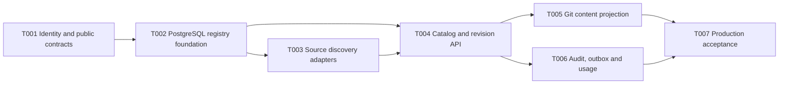

# M1 Semantic Registry Backend Plan

## Metadata

| Field | Value |
| --- | --- |
| Version | 1.0.0 |
| Status | Accepted |
| Authorization | Founder accepted T008/M0 and requested M1 backend development on 2026-09-02 |
| Scope | Backend vertical slice only; production Web is a dependent stream |
| Completion evidence | `docs/evidence/M1-COMPLETION-AUDIT/summary.md` |

## Delivery Strategy

Build one contract-first path and widen it incrementally. Each task leaves a usable, tested boundary; no task introduces infrastructure solely for a future milestone.

## Tasks

| Task | Outcome | Main proof |
| --- | --- | --- |
| T001 | Shared UUIDv7/TypeID package, prefix-safe OpenAPI schemas, semantic domain contracts | Unit, contract generation and drift tests |
| T002 | Forward identity migration plus normalized source, physical, semantic, evidence and ontology schema | Real PostgreSQL up/down/up, M0 backfill and repository tests |
| T003 | Catalog, PostgreSQL DDL/View SQL and dbt artifact adapters behind one discovery port | Real fixtures, incremental/idempotency and unresolved finding tests |
| T004 | Transactional application services and cursor-paginated catalog/revision/relationship APIs | Handler, repository and API integration tests |
| T005 | Deterministic Git content adapter and outbox-driven projection | Golden files, idempotent replay and failure recovery |
| T006 | Atomic audit/outbox events and privacy-bounded usage producers | Transaction, retention and payload rejection tests |
| T007 | 10,000-table benchmark and fresh-workspace source-to-detail acceptance | Exact-ref acceptance evidence and independent reviews |

## Reuse Decisions

- Adopt stable `go.jetify.com/typeid` rather than implementing UUIDv7/Base32.
- Reuse `pgx`, `sqlc`, `golang-migrate`, Testcontainers and the existing job/outbox runtime.
- Use `pg_query_go` behind the PostgreSQL SQL adapter; do not traverse SQL with regular expressions.
- Validate dbt artifacts against the published versioned JSON schemas and keep adapter DTOs versioned.
- Use PostgreSQL FTS and `pg_trgm` before adding a search engine or vector store.
- Do not adopt Temporal in M1. The decision reopens only with a proven workflow requirement involving durable external timers, compensation or service-spanning orchestration.
- Do not make Cube a core dependency. A Cube adapter remains optional and must pass the same source contract.

## Execution Gates

- A task starts only when dependencies are accepted, requirements and consistency checks pass, and its execution packet is Ready.
- Domain changes follow RED, GREEN, REFACTOR and include real PostgreSQL tests when constraints or transactions are involved.
- Generated OpenAPI/sqlc artifacts are committed and drift checked.
- Every task produces a scoped evidence summary and exact validation commands.
- T007 cannot claim M1 accepted until source-to-detail, immutable revision, ontology constraint, Git replay, privacy and performance scenarios all pass.
