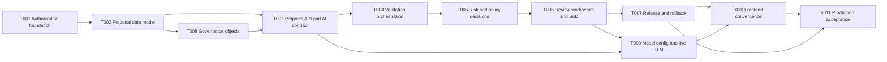

# M2 Governed Authoring Plan

## Metadata

| Field | Value |
| --- | --- |
| Milestone | M2 Governed AI Authoring |
| Specification | `docs/specs/m2-governed-authoring/spec.md` |
| Analysis | `docs/specs/m2-governed-authoring/analysis.md` (decision register D1–D8) |
| Work graph | `docs/specs/m2-governed-authoring/tasks.md` |
| Data model | `docs/specs/m2-governed-authoring/data-model.md` |
| Authorization | Founder accepted T009/M1 and authorized M2 planning on 2026-09-02; founder confirmed the D1–D8 decision register per recommendation on 2026-09-02; T001/T002 execution authorization is the next founder decision |
| Exit criterion | SSOT §17 M2: the team completes the closed loop "AI 提案、验证、人类审核、发布、回滚" |

## Delivery Strategy

M2 delivers the governed loop as one vertical slice on the M1 substrate, then deepens coverage.
Authorization and the proposal data model land first because every later write path depends on
server-side identity and immutable change-sets. The loop is proven with agent-attributed seeded
proposals (SSOT §8.6 attribution, not live model calls), after which live LLM generation is an
upgrade task, not a critical-path risk. The four governance objects join the same pipeline through
the object-generic change-set; validators, batch tooling and the production acceptance close the
milestone.

The diagram prunes transitive edges; `tasks.md` Depends/Blocks is the authoritative graph.

## Tasks

| Task | Outcome | Main proof |
| --- | --- | --- |
| T001 | Actor identity, RBAC enforcement and authorization audit | AuthZ integration tests; deny-by-default reason codes |
| T002 | Proposal, validation, policy, release and agent run schema with state machine | Migration lifecycle and immutability tests |
| T003 | Proposal API with structured patches and JSON-Schema-validated AI output | Contract tests; malformed output rejected pre-domain |
| T004 | Deterministic validator registry and orchestration on the job framework | Run records with version/digest; failure degrades to human |
| T005 | Recomputable risk assessment and versioned policy decisions | Golden recompute tests; explainable routing reasons |
| T006 | Expert and batch review commands with server-side separation of duties | FR-007 conflict tests; batch audit and auto-split tests |
| T007 | Immutable release manifest, publish switch and rollback-as-new-release | Immutability, projection and rollback journey tests |
| T008 | ModelGrain, EntityKey, JoinContract, PhysicalBinding on the shared pipeline | Object-generic proposal journey tests |
| T009 | Persisted model configuration and live LLM proposal generation | Contract test against configured provider |
| T010 | Authoring, review, release and rollback surfaces on real APIs | E2E at 1440x900 and 1024x768; preview labels preserved |
| T011 | Production acceptance of the full governed loop | Exact-ref journey incl. live LLM; security and release gates |

## Reuse Decisions

- Reuse the M1 `AppendCatalogRevision` transaction pattern (row lock, sequence, audit + outbox in
  one commit) for proposal submission and release cuts.
- Reuse the job/outbox framework for validation orchestration; register new event types
  (`proposal.changed`, `release.published`) on the strict `semlia.events/v1` envelope.
- Reuse the Git content projection writer for released content; no tags, remotes or history
  rewriting.
- Reuse `web/src/types.ts` and `data.ts` fixtures as the UI contract for proposals, validations,
  releases and capability actions; replace them at the `catalogRuntime.tsx` seam.
- Do not adopt `cel-go` in v1; the versioned rule-table evaluator reopens only when the founder
  confirms the TDR-015 policy-language condition.
- Do not build the auto-publish channel; M2 policy data structures are designed so M4 adds the
  auto lane without schema breaks.

## Execution Gates

- Per-task: `pnpm --filter @semlia/web lint`, `typecheck`, `test`, `build`; `go test ./...`,
  `go vet ./...`; `make contracts-check`; `git diff --check`.
- Milestone: `make check-source`, `make check-smoke`, web e2e at 1440x900 and 1024x768, migration
  downgrade/upgrade suites, release immutability and SoD test suites.
- Every task records evidence under `docs/evidence/M2-T0NN/summary.md` before review.
- Tasks enter execution only with a Ready packet; founder decision verdicts D1–D8 gate the packets
  they affect.
