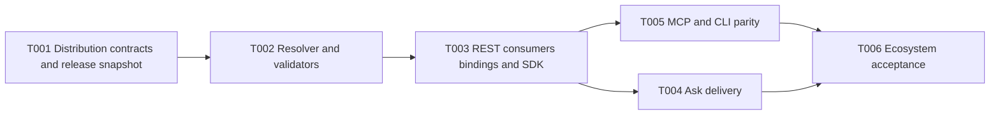

# M3 Headless Semantic Distribution Plan

## Metadata

| Field | Value |
| --- | --- |
| Version | 0.1.0 |
| Status | Confirmed |
| Specification | `docs/specs/m3-headless-semantic-distribution/spec.md` 0.1.0 Confirmed |
| Work graph | `docs/specs/m3-headless-semantic-distribution/tasks.md` |
| Alpha parent plan | `docs/specs/alpha-controlled-user/plan.md` 0.1.0 Confirmed |
| Last updated | 2026-09-04 |

## Strategy

M3 begins with one release-pinned resolver service and exposes it through channels in layers. The
Controlled-User Alpha implements the canonical data model, resolver, validation/refusal, REST,
minimal consumer bindings, generated TypeScript client and Ask. Later M3 work adds MCP and CLI over
the same application service, then webhooks, optional execution adapters and independent consumer
acceptance. No channel owns separate matching or Join logic.

## Delivery Profiles

| Task | Alpha 0.1.0 | Full M3 |
| --- | --- | --- |
| M3-T001 Distribution contracts and release snapshot | Required through Alpha T005 | Required |
| M3-T002 Resolver, plan validation and refusal | Required through Alpha T005 | Required |
| M3-T003 REST consumers, bindings and TypeScript client | Required through Alpha T005 | Required |
| M3-T004 Ask delivery | Required through Alpha T006 | Required |
| M3-T005 MCP and CLI parity | Deferred | Required |
| M3-T006 Webhook, optional execution and external acceptance | Deferred | Required, except execution remains optional |

## Reuse

- Reuse M2 immutable `release_assets` and `release_objects`; do not copy released content into a
  mutable query index.
- Reuse the M2 governed PhysicalBinding, ModelGrain, EntityKey and JoinContract representations.
- Reuse PostgreSQL FTS/trigram and exact stable addresses before adding embeddings or a search
  service.
- Reuse the existing authorization actions `semantic.resolve`, `semantic.execute`, `binding.read`
  and `binding.manage`.
- Reuse the M2 model provider and agent-run records for Ask interpretation.
- Reuse OpenAPI generation for Go and TypeScript; MCP and CLI adapt the canonical application
  service rather than the HTTP client.

## Gates

- Alpha M3 tasks follow the parent Alpha dependency and execution-packet gates.
- M3-T005 cannot begin until Alpha T005 is accepted and the MCP/CLI surface is separately confirmed.
- M3-T006 cannot claim milestone acceptance until Fluxale and an independent Agent use Semlia as
  their only semantic authority in a production-style flow.
- A resolved plan without an execution adapter is valid; an execution result is never simulated.
